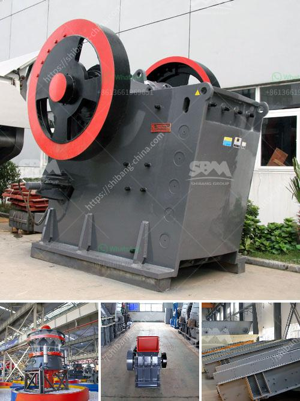

<h3>feldspar ball mills feldspar ball mills manufacturers</h3>
Feldspar is a mineral commonly found in nature and is one of the most abundant minerals on earth. It has a wide range of industrial applications due to its unique properties, making it an essential ingredient in many products. One important application of feldspar is in the manufacturing of ball mills.

A ball mill is a cylindrical device used to grind or mix materials like ores, chemicals, ceramic raw materials, and paints. It rotates around a horizontal axis, partially filled with the material to be ground plus the grinding medium. Different materials are used as media, including ceramic balls, flint pebbles, and stainless steel balls.

Feldspar ball mills are crucial equipment for grinding after materials have been crushed and are widely used in industries such as cement, silicate products, new building materials, refractory materials, fertilizers, black and non-ferrous metal beneficiation, and glass ceramics. These mills have the advantages of simple structure, easy maintenance, and high working efficiency.

The main components of a feldspar ball mill include the feeding part, discharging part, rotating part, and transmission part (reducer, small gear, motors, electrical control). The hollow shaft is made of cast steel, with its inner lining made of replaceable materials such as feldspar, rubber, or steel plate. The large-sized gear is usually made from cast steel, while the small-sized gear is made from forged steel.

Feldspar ball mills manufacturers offer various types of ball mill with different specifications. It is necessary to choose the suitable ball mill according to the needs of the industry and the materials properties. Some manufacturers also provide customized grinding solutions.

One important aspect to consider when selecting a feldspar ball mill is the type of grinding medium to be used. Different grinding media materials can have different effects on the milling process and the final product. Ceramic balls are commonly used in feldspar ball mills due to their high density and hardness, which enhance the grinding efficiency and reduce the contamination of the final product.

In addition to the choice of grinding media, the speed of rotation, filling rate, and grinding time of the ball mill can be adjusted to achieve the desired fineness and productivity. Experienced manufacturers of feldspar ball mills can provide guidance and recommendations based on their expertise and knowledge.

It is also important to choose a reliable manufacturer when purchasing feldspar ball mills. Reputable manufacturers not only provide high-quality products but also offer comprehensive after-sales services, including installation and maintenance support. They may also provide technical assistance and training to ensure the smooth operation of the mills.

In conclusion, feldspar ball mills are essential equipment for various industries due to their ability to grind and mix materials efficiently. When selecting a feldspar ball mill, it is crucial to consider factors such as the type of grinding media, desired fineness, and the reputation of the manufacturer. By choosing the right mill and using it correctly, businesses can enhance their productivity, reduce costs, and achieve high-quality final products.
<h3>Contact us</h3><ul><li><strong>Whatsapp:&nbsp;<a href="https://wa.me/8613661969651">+8613661969651</a></strong></li><li><a href="https://swt.shibang-china.com/?git&amp;zhl&amp;feldspar ball mills feldspar ball mills manufacturers"><strong>Online Service(chat now)</strong></a></li></ul><h3>Related</h3><ul><li><a href='jaw crusher dealer in dubai.md'>jaw crusher dealer in dubai</a></li><li><a href='mining equipment used during gold rush.md'>mining equipment used during gold rush</a></li><li><a href='ball mill capacity tons.md'>ball mill capacity tons</a></li><li><a href='how to start stone crusher unit in kenya.md'>how to start stone crusher unit in kenya</a></li><li><a href='conveyor belt manufacturer in indonesia in philippines.md'>conveyor belt manufacturer in indonesia in philippines</a></li></ul>