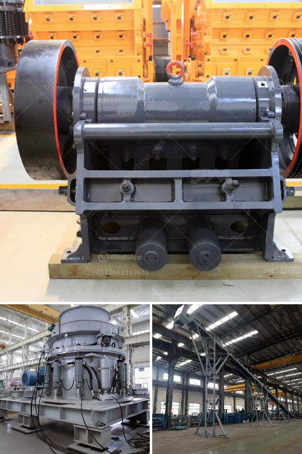

<h3>feldspar crusher machine</h3>
Feldspar is a common raw material in the production of ceramics and geopolymers. It has a fine particle size and low water absorption capacity, making it an excellent material for use in various industries. To process feldspar, it is usually crushed and grounded into powder. A feldspar crusher machine is essential in the process of making feldspar powder.

Before processing feldspar, it is necessary to crush the big size feldspar into smaller ones. The selection of the crushing equipment depends on the characteristics of different types of feldspar. Feldspar with high hardness is suitable for crushing with a jaw crusher, as it easily breaks down the material into smaller pieces, which is an essential step in the process of making feldspar powder.

The jaw crusher is a coarse crushing device that mainly used for the crushing of feldspar. The processing capacity of the jaw crusher is 5-1100 t/h, and the maximum feed size is 125-1200 mm. It is mainly used for primary crushing of various ores and bulk materials, and is widely used in mining, smelting, building materials, roads, railways, water conservancy and chemical industries.

After the raw material is crushed, it needs to be ground into powder. Grinding is an essential step in the process of making feldspar powder. The feldspar crusher machine includes the crusher machine and the grinding machine. For the crushing stage, it can be divided into primary crushing process, secondary crushing process, and fine crushing process.

Primary crushing: Large size feldspar is evenly sent into the jaw crusher by the vibrating feeder. After coarse crushing, the materials are sent to the cone crusher or impact crusher for secondary crushing.

Secondary crushing: The crushed feldspar materials are sent to the vibrating screen to be separated by the conveyor belt. The unqualified feldspar materials will be returned to the cone crusher or impact crusher for further crushing. The qualified feldspar materials will be sent to the sand making machine for shaping.

Fine crushing: The finely crushed feldspar materials are sent to the vibrating screen for screening. The materials that meet the specifications are sent to the sand making machine for further grinding, and the materials that do not meet the specifications are returned to the crusher for crushing again.

In the process of making feldspar powder, the grinding machine is a necessary device. The grinding process consists of several steps, including preliminary crushing, fine grinding, and grading. For feldspar with different particle size requirements, it needs to be selected and configured differently.

In conclusion, feldspar crusher machine plays an important role in the process of making feldspar powder. The key lies in the selection of the crusher machine and the grinding process. As the raw material for ceramics and geopolymers, feldspar has a wide range of applications. With the development of technology, the demand for feldspar will continue to increase, and the feldspar crusher machine will become more essential in the feldspar powder production process.
<h3>Contact us</h3><ul><li><strong>Whatsapp:&nbsp;<a href="https://wa.me/8613661969651">+8613661969651</a></strong></li><li><a href="https://swt.shibang-china.com/?git&amp;zhl&amp;feldspar crusher machine"><strong>Online Service(chat now)</strong></a></li></ul><h3>Related</h3><ul><li><a href='machine grinds talcum powder.md'>machine grinds talcum powder</a></li><li><a href='price of grinding machine in india.md'>price of grinding machine in india</a></li><li><a href='minister of gold mining ghana.md'>minister of gold mining ghana</a></li><li><a href='mtm 70 ball mill how much capacity.md'>mtm 70 ball mill how much capacity</a></li><li><a href='industrial vibrating screen price.md'>industrial vibrating screen price</a></li></ul>