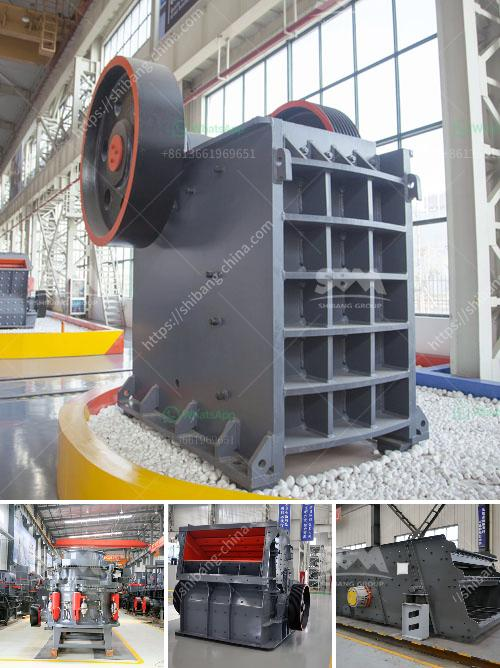

<h3>feldspar grinding machine manufacturers in india</h3>
Feldspar is one of the most abundant minerals found in the earth’s crust, making up about 60% of the crust’s total composition. It is characterized by its unique chemical composition that includes potassium, aluminum, silicon, and oxygen. Feldspar has various industrial applications, especially in the ceramics and glass manufacturing industries.

To harness the full potential of feldspar, it needs to be finely ground into a powder. Grinding feldspar is essential in ensuring the utilization of its abundant deposits, which are often found in India. However, due to the numerous challenges of processing these complex minerals, many feldspar manufacturers struggle to produce an optimal grinding solution.

In order to overcome these challenges, leading manufacturers from India have invested significantly in state-of-the-art grinding machines. These machines have revolutionized the feldspar processing industry by improving efficiency and reducing costs.

One notable company that specializes in grinding machines is Jyoti Engineering Works. They are at the forefront of feldspar grinding and provide solutions for the most complex and challenging requirements. Their grinding machines are highly efficient and are built to withstand the harshest conditions. With their cutting-edge technology and experienced engineers, Jyoti Engineering Works ensures that their machines deliver consistent and high-quality results.

Another renowned manufacturer in India is Gupta Grinding Mills. They offer a diverse range of grinding machines designed to meet the varying demands of different industries. From ball mills and crushers to separators and blenders, Gupta Grinding Mills offers a comprehensive selection of customized solutions for feldspar processing.

India is one of the largest producers of feldspar globally, and these manufacturers are greatly contributing to the development of the industry. By investing in advanced grinding machines, they are ensuring that the country maximizes its mineral resources while meeting the demands of domestic and international markets.

In conclusion, feldspar grinding machine manufacturers in India are focused on delivering optimal solutions for the grinding needs of their customers. These manufacturers have made significant investments in the latest grinding technologies and have successfully implemented them in their manufacturing processes. As a result, India has become one of the leading producers and exporters of feldspar powder. With the continued commitment of these manufacturers, the feldspar industry in India is poised for further growth and success.
<h3>Contact us</h3><ul><li><strong>Whatsapp:&nbsp;<a href="https://wa.me/8613661969651">+8613661969651</a></strong></li><li><a href="https://swt.shibang-china.com/?git&amp;zhl&amp;feldspar grinding machine manufacturers in india"><strong>Online Service(chat now)</strong></a></li></ul><h3>Related</h3><ul><li><a href='alluvial gold mining equipment price.md'>alluvial gold mining equipment price</a></li><li><a href='used coal washing plant sale.md'>used coal washing plant sale</a></li><li><a href='clinker making machine for sell germany.md'>clinker making machine for sell germany</a></li><li><a href='price of mobile stone crusher.md'>price of mobile stone crusher</a></li><li><a href='crusher plant in construction.md'>crusher plant in construction</a></li></ul>