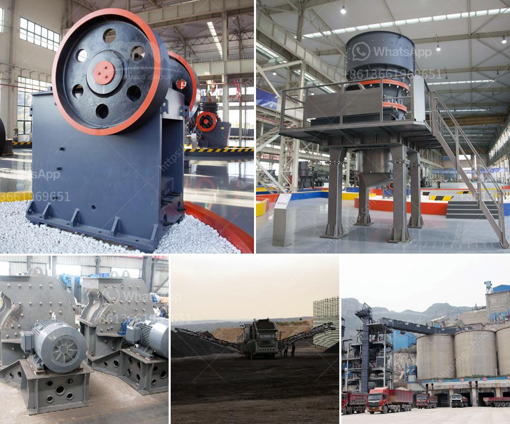

<h3>feldspar powder machine</h3>
Feldspar is a common mineral in the Earth's crust, which accounts for about 60% of the total mineral content. It is a versatile industrial material with a wide range of applications. One of the most common uses of feldspar is as a filler or extender in various industries such as ceramics, glass manufacturing, and paints. To meet the growing demand for feldspar products, the feldspar powder machine has become an essential tool in the feldspar processing industry.

The feldspar powder machine is designed to process feldspar powder in various sizes for different applications. The feldspar powder machine consists of a main unit, a classifier, a cyclone collector, a dust cleaner, an induced draft fan, a control system, and a pipe system. The main unit consists of a grinding chamber, which rotates on a horizontally mounted shaft. Inside the grinding chamber, there are grinding balls or rods. When the machine is in operation, the grinding media in the grinding chamber is continuously impacted and ground by the rotating shaft, resulting in the production of fine feldspar powder.

The classifier in the feldspar powder machine ensures that the particles are separated according to their size. This allows for the production of feldspar powder in different sizes to cater to various industry requirements. The cyclone collector and dust cleaner work together to remove the fine particles and impurities from the feldspar powder, ensuring a high-quality end product.

The feldspar powder machine is equipped with a control system that allows for easy operation and monitoring. The machine can be adjusted to produce feldspar powder with different particle sizes, ensuring maximum flexibility and efficiency.

In conclusion, the feldspar powder machine plays a crucial role in the feldspar processing industry. It provides a reliable and efficient method for producing high-quality feldspar powder for various industrial applications. With its advanced features and user-friendly design, the feldspar powder machine is a valuable asset for any feldspar processing plant.
<h3>Contact us</h3><ul><li><strong>Whatsapp:&nbsp;<a href="https://wa.me/8613661969651">+8613661969651</a></strong></li><li><a href="https://swt.shibang-china.com/?git&amp;zhl&amp;feldspar powder machine"><strong>Online Service(chat now)</strong></a></li></ul><h3>Related</h3><ul><li><a href='slag quarry equipments supplies in algeria.md'>slag quarry equipments supplies in algeria</a></li><li><a href='dry iron ore processing methods.md'>dry iron ore processing methods</a></li><li><a href='raymond mill model.md'>raymond mill model</a></li><li><a href='cost of equipment used in mining lead ore.md'>cost of equipment used in mining lead ore</a></li><li><a href='hammer mills in harare zimbabwe.md'>hammer mills in harare zimbabwe</a></li></ul>