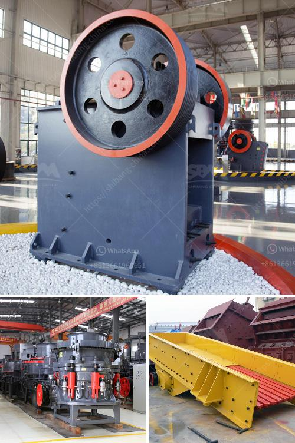

<h3>fine powder grinders machine</h3>
Fine powder grinders machine, also known as powdered grinders, are devices that are used to grind various materials into fine powders. These machines are widely used in industries such as mining, agriculture, pharmaceuticals, and food processing, just to name a few. 

The grinders consist of a motor, blades, and a container to hold the material being ground. The motor powers the blades, which spin at a high speed and pulverize the material into fine particles. The container collects the ground powder, making it easy to remove and store for further use.

One of the main advantages of fine powder grinders is their ability to grind materials into very fine powders. This is especially useful in industries that require precise particle sizes, such as pharmaceuticals, where certain medications need to be in powder form for easy ingestion and absorption by the body.

Another advantage of using these machines is their efficiency. Due to their high-speed blades, they can grind materials quickly and efficiently, saving time and energy. This is especially important in industries that require large quantities of finely ground materials on a regular basis.

Furthermore, fine powder grinders are versatile and can grind a wide range of materials. From minerals and ores to spices and herbs, these machines can handle different materials effectively, providing users with flexibility and convenience.

However, it is essential to choose the right grinder for specific materials and applications. Factors such as the hardness and moisture content of the material need to be considered to ensure optimal grinding results.

In conclusion, fine powder grinders machines are valuable tools in various industries due to their ability to grind materials into fine powders efficiently and effectively. They provide users with precise particle sizes and can handle a wide range of materials. With proper selection and use, these machines can greatly improve productivity and quality in many industries.
<h3>Contact us</h3><ul><li><strong>Whatsapp:&nbsp;<a href="https://wa.me/8613661969651">+8613661969651</a></strong></li><li><a href="https://swt.shibang-china.com/?git&amp;zhl&amp;fine powder grinders machine"><strong>Online Service(chat now)</strong></a></li></ul><h3>Related</h3><ul><li><a href='hard rock ultrafine grinder in canada.md'>hard rock ultrafine grinder in canada</a></li><li><a href='price rock crusher peru.md'>price rock crusher peru</a></li><li><a href='rock crusher plant cost.md'>rock crusher plant cost</a></li><li><a href='rock crushers prices.md'>rock crushers prices</a></li><li><a href='raymond mill production line.md'>raymond mill production line</a></li></ul>