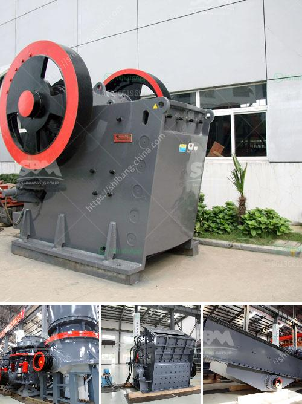

<h3>floatation equipment for mining for sale in south africa</h3>
When it comes to mining operations in South Africa, safety is always a top priority. And one of the foremost safety measures in mining operations is the use of appropriate floatation equipment for sale. This equipment plays a crucial role in ensuring the safety of workers and the efficiency of mining operations.

Floatation equipment, also known as flotation machines, are devices that provide an interface for ore and water pulp separation. These machines use the principle of buoyancy to separate valuable minerals from the ore. By injecting air bubbles into the ore slurry, these machines enable the selective attachment of certain minerals to the bubbles and their subsequent recovery.

In South Africa, where mining operations are often conducted in hazardous and challenging conditions, the availability of high-quality floatation equipment is of utmost importance. Fortunately, there are several reputable suppliers in the country offering a wide range of floatation equipment for sale.

One such supplier is XYZ Mining Equipment, a trusted company with decades of experience in the mining industry. XYZ Mining Equipment offers a comprehensive selection of floatation equipment, including flotation cells, froth pumps, and flotation columns. These machines are designed to meet the diverse needs of South African mining companies and ensure optimal performance.

For example, XYZ Mining Equipment's flotation cells are known for their robust construction and high-performance capabilities. These cells can handle a wide range of ore types and deliver excellent recovery rates. Moreover, they are equipped with advanced features such as adjustable rotor speed, self-aspirating capability, and automatic pulp level control. This ensures that the flotation cells operate efficiently and minimize the risk of downtime, maximizing productivity for mining operations.

In addition to flotation cells, XYZ Mining Equipment also offers froth pumps designed specifically for flotation applications. These pumps are capable of handling the highly abrasive and corrosive slurry commonly found in mining operations. With features like heavy-duty construction, replaceable wear parts, and efficient impeller designs, these pumps provide reliable and long-lasting performance.

Another important equipment in floatation operations is the flotation column. XYZ Mining Equipment's flotation columns are renowned for their high selectivity and excellent recovery rates. These columns are designed to maximize both grade and recovery, making them ideal for processing complex ores. With their compact size and simple installation, these columns offer a cost-effective solution for various mining applications.

In conclusion, floatation equipment is an essential component of mining operations in South Africa. It ensures the safety of workers and the efficiency of ore separation. With reputable suppliers like XYZ Mining Equipment offering a wide range of floatation equipment for sale, South African mining companies can access top-quality machines that meet their specific requirements. By investing in reliable floatation equipment, mining operations can optimize their productivity and maintain a safe working environment.
<h3>Contact us</h3><ul><li><strong>Whatsapp:&nbsp;<a href="https://wa.me/8613661969651">+8613661969651</a></strong></li><li><a href="https://swt.shibang-china.com/?git&amp;zhl&amp;floatation equipment for mining for sale in south africa"><strong>Online Service(chat now)</strong></a></li></ul><h3>Related</h3><ul><li><a href='hammer mills for limestone.md'>hammer mills for limestone</a></li><li><a href='list mining equipments are used in granite quarries.md'>list mining equipments are used in granite quarries</a></li><li><a href='stone crusher machine for sale tanzania.md'>stone crusher machine for sale tanzania</a></li><li><a href='mobile crushing machine manufacturer.md'>mobile crushing machine manufacturer</a></li><li><a href='crushing plant for aggregate india.md'>crushing plant for aggregate india</a></li></ul>