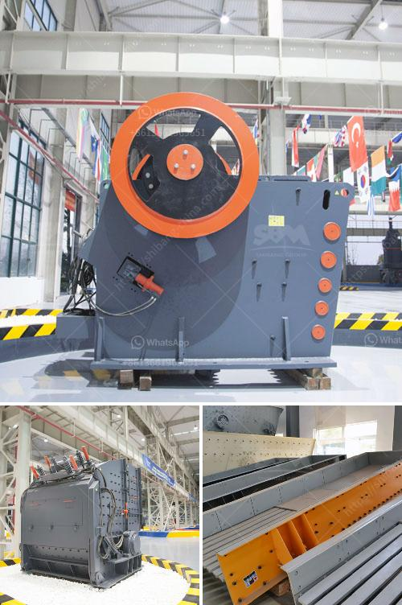

<h3>formula de capacidad de chancadora</h3>
The capacity formula of a crusher, also known as the crushing capacity formula, is a vital tool in determining the optimal capacity of a crusher. This formula is utilized to calculate the theoretical capacity of a crusher based on its physical dimensions and operational parameters. By understanding this formula, one can optimize the performance of a crusher and ensure its output meets the desired requirements. In this article, we will delve into the formula and its implications.

The width of the jaw opening, represented by "W," is the distance between the two jaw plates. This parameter represents the maximum size of material that can be fed into the crusher and is a crucial factor in determining the capacity.

The setting, denoted by "S," refers to the distance between the two jaw plates at the bottom. This parameter dictates the size of the crushed material and plays a significant role in the crusher's capacity.

The density of the material being crushed, represented by "d," is an essential factor in determining the crusher's capacity. It describes the mass per unit volume of the material and influences its flow characteristics during the crushing process.

The velocity of the material entering the crusher, denoted by "V," signifies the speed at which the material is fed. A higher velocity can increase the crusher's capacity by improving the material's flow and reducing the chance of clogging.

Efficiency, represented by "h," measures how well the crusher utilizes the input power to crush the material. It accounts for factors like friction, mechanical losses, and wear. A higher efficiency value translates to better utilization of energy, maximizing the crusher's capacity.

The thickness of the jaw plate, denoted by "t," refers to the distance between the two jaw plates at their thickest point. This parameter affects the structural integrity and durability of the crusher, ensuring it can withstand the crushing forces.

By inputting the appropriate values into the formula, the crushing capacity of a crusher can be calculated. However, it is important to note that this is a theoretical calculation, and actual operating conditions may result in different values. Factors like the type of material, moisture content, feed size distribution, and crusher design can affect the crusher's efficiency and, consequently, its capacity.

In conclusion, the crushing capacity formula is an indispensable tool in determining the optimal capacity of a crusher. By considering various parameters such as the jaw opening, setting, material density, velocity, efficiency, and jaw plate thickness, the formula provides valuable insights into a crusher's performance. While this formula offers a theoretical capacity, it serves as a foundation for optimizing the crusher's output and ensuring it meets the required specifications.
<h3>Contact us</h3><ul><li><strong>Whatsapp:&nbsp;<a href="https://wa.me/8613661969651">+8613661969651</a></strong></li><li><a href="https://swt.shibang-china.com/?git&amp;zhl&amp;formula de capacidad de chancadora"><strong>Online Service(chat now)</strong></a></li></ul><h3>Related</h3><ul><li><a href='quartz plant in india.md'>quartz plant in india</a></li><li><a href='construction debris recycling.md'>construction debris recycling</a></li><li><a href='jaw crusher for sale in usa.md'>jaw crusher for sale in usa</a></li><li><a href='gypsum board thailand manufacturer.md'>gypsum board thailand manufacturer</a></li><li><a href='ulltra fine grinding mill.md'>ulltra fine grinding mill</a></li></ul>