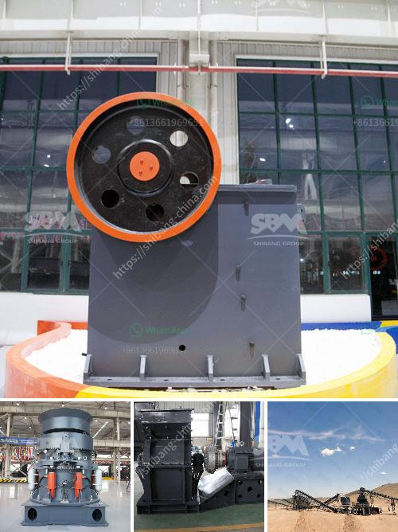

<h3>functions of the hammer mill</h3>
The hammer mill is a versatile machine that is capable of grinding, shredding, splitting, and pulverizing materials. This equipment can be used to assist with handling wood, agricultural residues, metal, or even waste materials like fruit and vegetables. People have been using hammer mills for countless years to create meals or other food items. Today, they are an essential part of the manufacturing and recycling industries.

One of the functions of the hammer mill is the initial size reduction of materials. With the help of a series of hammers mounted on a rotor, the machine is able to break down any material fed into it. This initial size reduction is critical in preparing materials for subsequent processes such as grinding or pulverizing. The size reduction achieved by a hammer mill depends on several factors like the thickness and density of the material, the speed of the rotor, and the size and shape of the hammers.

Another important function of the hammer mill is to break hard, dense materials into smaller pieces. Some materials, such as solid wood, can be too large or too dense to be directly processed by subsequent machinery. In such cases, the hammer mill can be used to pulverize the wood into smaller particles that can then be processed further. Similarly, other dense materials like metal or plastics can be shredded into smaller pieces for easier handling and recycling.

The hammer mill is also widely used in the processing of various feeds. Any agricultural or forest waste can be processed through this machine to convert them into livestock or poultry feeds. In many cases, the hammer mill is used to grind whole grains or maize cobs into a fine powder, which is then mixed with other ingredients to prepare specific animal feed formulations. This process enhances the digestibility and nutritional value of the feeds, resulting in healthier livestock and improved feed efficiency.

Furthermore, the hammer mill has a role in waste management. Whether it is in a large-scale recycling facility or a small-scale composting operation, this machine can aid in the conversion of waste materials into a more manageable form. For instance, fruit and vegetable waste can be fed into a hammer mill to create a pulp-like substance, which can be further processed into compost or used as a feedstock for biogas production. By pulverizing waste materials, the hammer mill not only reduces the volume but also simplifies the subsequent processing steps.

In conclusion, the hammer mill is a versatile and indispensable machine that plays a significant role in various industries. From size reduction to shredding and pulverizing, it has numerous functions that contribute to the efficiency and productivity of different processes. Whether it is in the manufacturing, recycling, or agricultural sector, the hammer mill continues to be a crucial piece of equipment that helps enhance operations and generate value from raw materials and waste.
<h3>Contact us</h3><ul><li><strong>Whatsapp:&nbsp;<a href="https://wa.me/8613661969651">+8613661969651</a></strong></li><li><a href="https://swt.shibang-china.com/?git&amp;zhl&amp;functions of the hammer mill"><strong>Online Service(chat now)</strong></a></li></ul><h3>Related</h3><ul><li><a href='stone crushers for sale in philippines.md'>stone crushers for sale in philippines</a></li><li><a href='mobile crusher triman.md'>mobile crusher triman</a></li><li><a href='picture of complete of quarry crushing plant nigeria.md'>picture of complete of quarry crushing plant nigeria</a></li><li><a href='products lm vertical grinding mills.md'>products lm vertical grinding mills</a></li><li><a href='types of crushing machine.md'>types of crushing machine</a></li></ul>