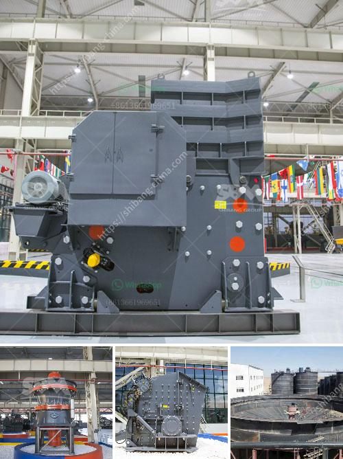

<h3>german cement grinding unit operations</h3>
German cement grinding unit operations play a crucial role in ensuring the quality and durability of the final cement product. These units are responsible for the smooth and efficient grinding of clinker, gypsum, and other additives into the desired particle size.

One of the key operations in a cement grinding unit is the ball mill. This machine grinds the raw materials into a fine powder, which is then used to produce cement. The grinding process occurs in a closed system, ensuring that the product is free from any impurities or contaminants.

The ball mill operates by rotating the cylindrical vessel, which contains the grinding media. As the vessel rotates, the media cascade and grind the clinker and other materials, resulting in the formation of a fine powder. The critical speed of the ball mill, along with the size and weight of the grinding media, determines the grinding efficiency.

Another important operation in a cement grinding unit is the cement mill. This mill grinds the clinker and gypsum together into a fine powder, which is then used to produce cement. The grinding process in a cement mill involves impacting and crushing of the clinker particles, resulting in the formation of a fine powder.

The German cement grinding units also incorporate other processes to ensure the quality of the final product. These include the use of separators, which separate the fine and coarse particles, and the use of additives to enhance the properties of the cement. Some common additives used in cement grinding units include limestone, fly ash, and slag.

Additionally, the German cement grinding units utilize advanced control systems to monitor and optimize the grinding process. These control systems continuously analyze various parameters, such as the mill power, mill feed, and separator speed, to ensure that the grinding operation is efficient and consistent.

Efficient and sustainable energy utilization is also a key consideration in German cement grinding unit operations. These units are equipped with energy-efficient motors, which help reduce energy consumption and greenhouse gas emissions. In addition, waste heat recovery systems are often employed to capture and utilize the excess heat generated during the grinding process.

In conclusion, German cement grinding unit operations are essential for producing high-quality cement. The ball mill and cement mill play a critical role in ensuring that the clinker, gypsum, and other additives are ground into a fine powder. Advanced control systems and efficient energy utilization further enhance the grinding process. These operations not only ensure the durability and strength of the final cement product but also contribute to sustainable and environmentally friendly manufacturing processes.
<h3>Contact us</h3><ul><li><strong>Whatsapp:&nbsp;<a href="https://wa.me/8613661969651">+8613661969651</a></strong></li><li><a href="https://swt.shibang-china.com/?git&amp;zhl&amp;german cement grinding unit operations"><strong>Online Service(chat now)</strong></a></li></ul><h3>Related</h3><ul><li><a href='basalt crushing production line.md'>basalt crushing production line</a></li><li><a href='quarry equipment.md'>quarry equipment</a></li><li><a href='grinding machinery manufecture in africa.md'>grinding machinery manufecture in africa</a></li><li><a href='used stone crusher plant for sale andhra pradesh.md'>used stone crusher plant for sale andhra pradesh</a></li><li><a href='buy gravel crusher.md'>buy gravel crusher</a></li></ul>