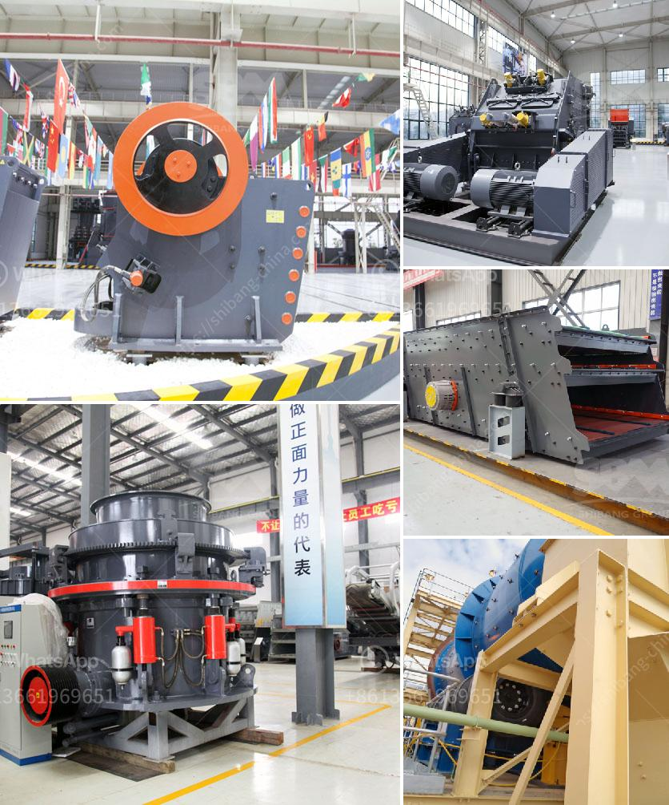

<h3>germany gypsum board manufacturing equipment</h3>
Germany is known for its advanced engineering and innovative manufacturing technologies. One industry that exemplifies this is the gypsum board manufacturing equipment sector. Germany is a leading producer and exporter of gypsum boards, and its equipment plays a crucial role in meeting the growing demand for this versatile construction material.

Gypsum boards, also known as drywall or plasterboards, are widely used in the construction industry for interior walls and ceilings. They offer several advantages over traditional materials such as cement and wood, including fire resistance, soundproofing, lightweight, and ease of installation. This has led to a surge in demand for gypsum boards worldwide, creating a need for efficient and reliable manufacturing equipment.

German manufacturers have responded to this demand by developing state-of-the-art machinery for gypsum board production. These machines are designed to optimize productivity, accuracy, and quality while minimizing energy consumption and waste production. They incorporate cutting-edge technologies, automation, and precision engineering to ensure seamless manufacturing processes.

One example of such equipment is the gypsum board forming machine. This machine enables the production of gypsum boards with precise sizes, shapes, and thicknesses. It consists of a continuous conveyor belt that transports the gypsum slurry, which is a mixture of water, gypsum powder, and additives, to the forming station. At the forming station, the slurry is spread evenly and molds are used to shape it into the desired board size and thickness. The machine then uses vacuum and vibration systems to remove excess water, ensuring uniform moisture content throughout the board. Finally, the formed gypsum boards are cut to the required lengths and transferred to the drying chambers.

Drying is a crucial step in gypsum board manufacturing, as it determines the final board quality and properties. German manufacturers have developed advanced drying systems that facilitate rapid, energy-efficient drying without compromising on board integrity. These systems utilize hot air circulation, temperature control, and moisture sensors to ensure optimal drying conditions, while minimizing energy consumption and preventing over-drying.

Additionally, Germany is at the forefront of developing equipment for gypsum board edge finishing. Smooth and precise edges are essential for achieving a high-quality finished product. German manufacturers have devised specialized edge finishing machines that use precise cutting tools and sanding mechanisms to achieve flawlessly straight and smooth edges. This equipment also ensures uniform thickness and edge profiles across all finished boards.

The gypsum board manufacturing equipment sector in Germany is known for its commitment to innovation and sustainability. Manufacturers are continually investing in research and development to improve their equipment's performance, energy efficiency, and environmental footprint. This dedication to innovation has positioned Germany as a global leader in gypsum board manufacturing, catering to the ever-growing demand for this versatile, sustainable construction material.

In conclusion, Germany's gypsum board manufacturing equipment is a testament to its engineering prowess. The country's manufacturers have developed cutting-edge machinery that optimizes productivity, accuracy, and sustainability. With its advanced forming, drying, and edge finishing equipment, Germany continues to play a crucial role in meeting the global demand for gypsum boards.
<h3>Contact us</h3><ul><li><strong>Whatsapp:&nbsp;<a href="https://wa.me/8613661969651">+8613661969651</a></strong></li><li><a href="https://swt.shibang-china.com/?git&amp;zhl&amp;germany gypsum board manufacturing equipment"><strong>Online Service(chat now)</strong></a></li></ul><h3>Related</h3><ul><li><a href='crusher plant in construction.md'>crusher plant in construction</a></li><li><a href='big impact crusher 1000 ton per hour.md'>big impact crusher 1000 ton per hour</a></li><li><a href='production line chrome ore concentration plant mar.md'>production line chrome ore concentration plant mar</a></li><li><a href='used crushing quarry plant in south africa.md'>used crushing quarry plant in south africa</a></li><li><a href='copper slag manufacturing process.md'>copper slag manufacturing process</a></li></ul>