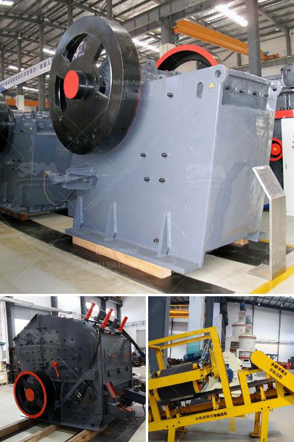

<h3>germany standard pyrophyllite powder grinding mill</h3>
Germany has been a frontrunner in the field of engineering and technology, and its impact can also be seen in the mining industry. One such example is the Germany standard pyrophyllite powder grinding mill, which has revolutionized the way pyrophyllite is processed and utilized.

Pyrophyllite is a naturally occurring mineral that is widely used in various industries due to its unique properties. It is a hydrous aluminum silicate, which means it contains water molecules within its crystalline structure. This mineral is known for its excellent thermal stability, low heat conductivity, and high dielectric strength, making it ideal for use in refractory ceramics, electrical insulators, and other high-temperature applications.

The grinding process plays a crucial role in the utilization of pyrophyllite, as it involves reducing the particle size to enhance its properties. The Germany standard pyrophyllite powder grinding mill has been specifically designed for this purpose and outshines its competitors in terms of performance and efficiency. It is equipped with advanced grinding technology and a highly efficient classifier system, which ensures a precise and consistent particle size distribution.

The mill operates on the principle of impact and attrition, where the pyrophyllite is fed into the grinding chamber and comes into contact with high-speed rotating hammers. These hammers strike the mineral particles, causing them to break and disintegrate into smaller fragments. The size-reduced particles are then carried by the air stream and are further classified by the dynamic classifier system, which separates them based on their size and controls the final product fineness.

One of the key features of the Germany standard pyrophyllite powder grinding mill is its energy efficiency. The mill is designed to minimize energy consumption while maximizing the grinding efficiency. The use of advanced grinding technology and optimized airflow patterns ensures that the mill operates at its highest efficiency, resulting in significant energy savings. This not only reduces operational costs but also helps in minimizing the environmental impact.

In addition to its energy efficiency, the Germany standard pyrophyllite powder grinding mill offers outstanding reliability and durability. It is built to withstand the harsh operating conditions of mining environments and is designed for continuous operation. The mill is made from high-quality materials and is equipped with robust components, ensuring a long service life and minimal maintenance requirements.

The Germany standard pyrophyllite powder grinding mill has gained immense popularity in the mining industry due to its numerous advantages. It offers significant improvements in terms of grinding efficiency, energy consumption, and product quality. Furthermore, it allows for precise control over the particle size distribution, making it an ideal choice for various applications requiring specific particle sizes.

In conclusion, the Germany standard pyrophyllite powder grinding mill is a game-changer in the mining industry. It exemplifies Germany's prowess in engineering and technology and showcases its commitment to developing innovative solutions. With its exceptional performance, energy efficiency, and reliability, it has gained the trust and admiration of mining professionals worldwide.
<h3>Contact us</h3><ul><li><strong>Whatsapp:&nbsp;<a href="https://wa.me/8613661969651">+8613661969651</a></strong></li><li><a href="https://swt.shibang-china.com/?git&amp;zhl&amp;germany standard pyrophyllite powder grinding mill"><strong>Online Service(chat now)</strong></a></li></ul><h3>Related</h3><ul><li><a href='cost of an industrial mill.md'>cost of an industrial mill</a></li><li><a href='gravimetric centrifugal gold concentrator.md'>gravimetric centrifugal gold concentrator</a></li><li><a href='kaolin clay processing line.md'>kaolin clay processing line</a></li><li><a href='stone crusher finding.md'>stone crusher finding</a></li><li><a href='copper concentrate mobile crusher.md'>copper concentrate mobile crusher</a></li></ul>