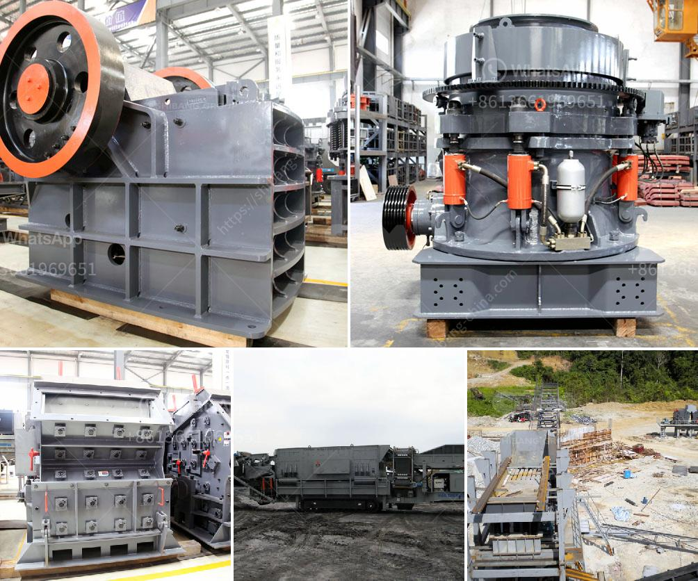

<h3>gold crushing machine and price</h3>
Gold mining is a crucial industry in many countries around the world. Numerous nations rely on this precious metal for various purposes, including jewelry production, wealth accumulation, and as an investment. To extract gold from the earth through mining processes, powerful machinery known as gold crushing machines pulverize rocks and stones into smaller particles.

Gold crushing machines come in various specifications and models, catering to a range of mining needs. Different types of crushers help recover gold from ore materials efficiently. Some models are designed to be stationary, while others are mobile, enabling operators to move them around the mining site with ease.

One of the most popular gold crushing machines is the jaw crusher. It is often used in the primary stage of gold crushing. The machine has a sturdy construction, consisting of an outer frame, an eccentric shaft, toggle plates, and a movable jaw. The materials are fed into the crushing chamber, where the jaw compresses them until they break into smaller pieces suitable for further processing.

Cone crushers are also commonly used in gold mining operations. These machines have a conical shape, with a gyrating spindle and a crushing chamber that narrows towards the bottom. The rocks or ores are fed into the top of the cone crusher, where they are crushed and then discharged through the bottom opening.

Another gold crushing machine is the impact crusher. These machines utilize a high-speed rotor and hammers to strike and break the materials fed into them. The rotating hammers impact the rocks or ores, causing them to break into smaller pieces. Impact crushers are particularly suitable for processing brittle materials.

When considering the price of gold crushing machines, several factors come into play. The type of machine, its capacity, and the brand are essential determinants of the price. Generally, larger machines with higher capacity are more expensive. Additionally, reputable brands that offer reliable and durable machines tend to have higher prices compared to lesser-known or lower-quality brands.

The price range for gold crushing machines varies widely, with prices ranging from a few thousand dollars to several hundred thousand dollars. It is crucial for mining companies to assess their budget, mining requirements, and production needs before purchasing a gold crushing machine. Conducting thorough research on available options and comparing prices from different suppliers can help ensure companies make an informed purchasing decision.

Furthermore, it is essential to consider the total cost of ownership when evaluating the price of a gold crushing machine. Maintenance, spare parts availability, and energy consumption contribute to the overall cost of operating the machine throughout its lifespan. A machine with higher upfront costs but lower maintenance and energy expenses may provide better value in the long run.

In conclusion, gold crushing machines play a vital role in the mining industry by enabling the extraction of this valuable metal from rocks and ores. Different types of crushers, such as jaw crushers, cone crushers, and impact crushers, cater to various mining needs. The price of gold crushing machines depends on factors like machine type, capacity, and brand. Mining companies should carefully assess their requirements and budget to make an informed purchasing decision. Additionally, considering the total cost of ownership can help determine the best value for a gold crushing machine.
<h3>Contact us</h3><ul><li><strong>Whatsapp:&nbsp;<a href="https://wa.me/8613661969651">+8613661969651</a></strong></li><li><a href="https://swt.shibang-china.com/?git&amp;zhl&amp;gold crushing machine and price"><strong>Online Service(chat now)</strong></a></li></ul><h3>Related</h3><ul><li><a href='quartz stone quarry in nigeria.md'>quartz stone quarry in nigeria</a></li><li><a href='limestone crusher limestone crusher equipment.md'>limestone crusher limestone crusher equipment</a></li><li><a href='ball mill pictures.md'>ball mill pictures</a></li><li><a href='list used cement factory for sale in germany.md'>list used cement factory for sale in germany</a></li><li><a href='manufacture of vibrating screens.md'>manufacture of vibrating screens</a></li></ul>