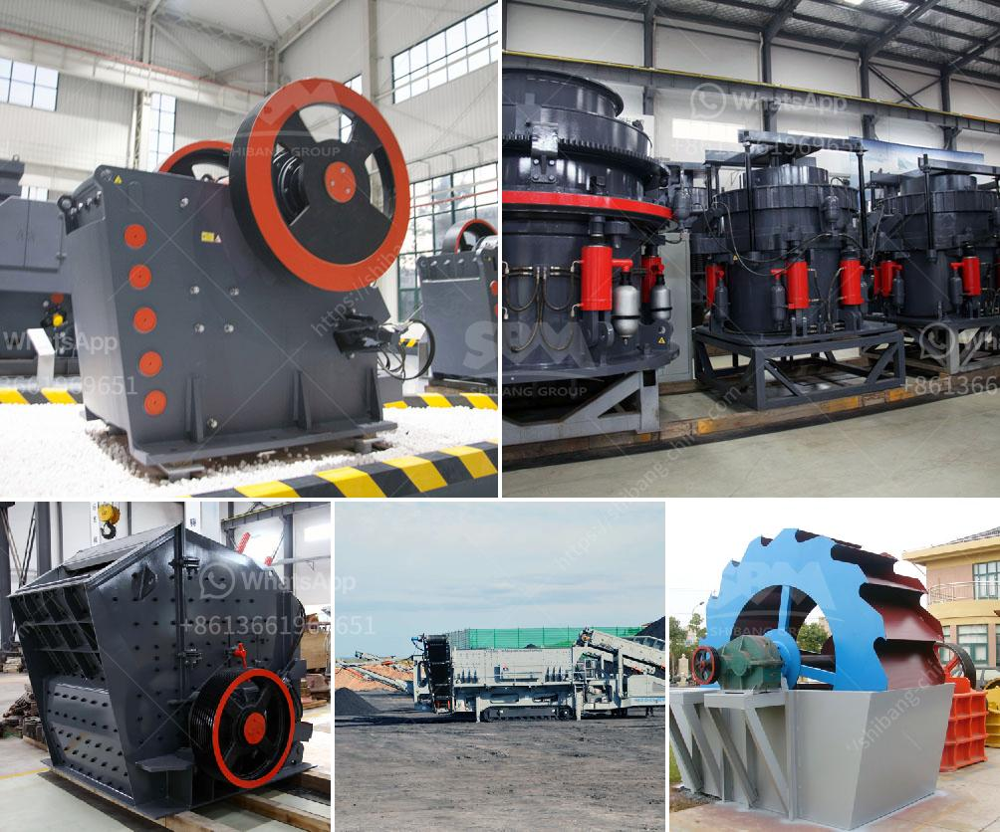

<h3>gold milling machine for small scale production germany</h3>
Gold milling machine for small scale production Germany represents a lucrative and profitable opportunity for entrepreneurs looking to start a small-scale business. Gold milling machines offer unparalleled performance and efficiency when it comes to extracting gold from ore. These machines are capable of separating gold efficiently from waste materials to yield pure gold grains.

Gold milling machines are widely used in small scale production, mostly because of their ease of use and low cost. Additionally, gold milling machines are proven to extract gold efficiently without harmful emissions or environmental damage. These machines are compact and portable, making them suitable for small scale operations in remote areas or regions with limited infrastructure.

Germany is a global leader in gold milling machine production, with advanced manufacturing techniques and facilities to meet international standards. German-made gold milling machines are renowned for their reliability, durability, and precision engineering. These machines are designed to withstand the rigors of continuous operation while maintaining high-quality outputs.

The gold milling machines produced in Germany are technologically advanced and come with various features to enhance efficiency. These features include automatic feeding systems, adjustable settings for different ore types, and precise control mechanisms. Additionally, they are equipped with safety measures to protect operators and prevent accidents or mishaps.

Investing in a gold milling machine for small scale production in Germany offers numerous advantages. Firstly, it allows entrepreneurs to tap into the lucrative gold market and profit from the high demand for gold. Furthermore, it provides an opportunity to create jobs and support local communities. The small scale production of gold also contributes to sustainable development by promoting responsible mining practices and minimizing environmental impact.

In conclusion, gold milling machines for small scale production in Germany offer a promising business opportunity. With their efficiency, reliability, and advanced features, these machines are ideal for entrepreneurs looking to enter the gold market. Investing in German-made gold milling machines ensures high-quality outputs, environmental sustainability, and economic growth.
<h3>Contact us</h3><ul><li><strong>Whatsapp:&nbsp;<a href="https://wa.me/8613661969651">+8613661969651</a></strong></li><li><a href="https://swt.shibang-china.com/?git&amp;zhl&amp;gold milling machine for small scale production germany"><strong>Online Service(chat now)</strong></a></li></ul><h3>Related</h3><ul><li><a href='how to acid washing silica sand.md'>how to acid washing silica sand</a></li><li><a href='jaw crusher for sale in usa.md'>jaw crusher for sale in usa</a></li><li><a href='cotizacion de equipos mineros.md'>cotizacion de equipos mineros</a></li><li><a href='portable cone crusher plant.md'>portable cone crusher plant</a></li><li><a href='construction debris recycling.md'>construction debris recycling</a></li></ul>