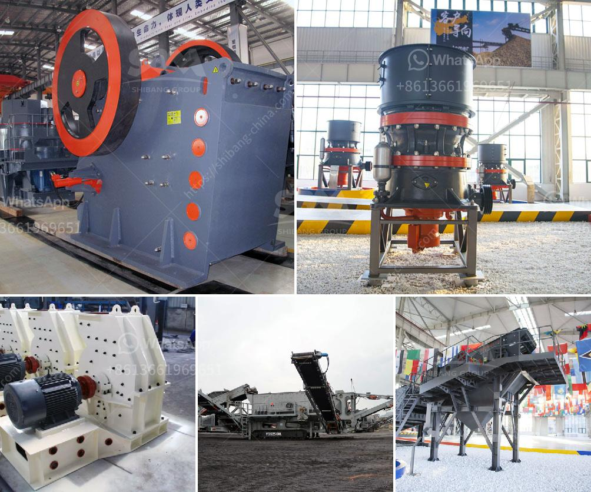

<h3>gold milling plant in zimbabwe</h3>
Gold is a precious metal that holds immense value in the global market. Its shine, rarity, and durability have made it a symbol of wealth and prosperity for centuries. Zimbabwe, a landlocked country in Southern Africa, is blessed with abundant mineral resources, particularly gold. The country has witnessed a surge in gold mining activities in recent years, and this has led to the establishment of several gold milling plants in Zimbabwe.

A gold milling plant is a facility where gold ore is crushed and processed to extract gold from its rock form. These plants consist of multiple steps, including crushing, grinding, leaching, and gold extraction, to produce refined gold. Zimbabwe has attracted numerous investors in the gold mining sector, and as a result, the country has experienced a significant boost in gold production.

One prominent gold milling plant in Zimbabwe is the Shamva Mining Center located in the Mazowe area, about 90 kilometers northeast of Harare. The plant has been in operation for more than two decades and has witnessed tremendous growth over the years. It has been at the forefront of employing advanced technologies and modern equipment to enhance gold recovery rates and minimize environmental impact.

The Shamva Mining Center employs highly skilled workers who operate state-of-the-art machinery to crush and grind the gold ore. The crushed ore is then passed through a series of tanks where a chemical process called leaching is initiated. Leaching helps to dissolve the gold particles from the crushed ore. Once the leaching process is complete, the gold-bearing solution is collected and transported to another section of the milling plant for further processing.

In the subsequent stage, the gold-bearing solution undergoes a series of purification processes to separate the gold from impurities. The refined gold is then molded into bars or ingots, ready for sale in the global market. The remaining tailings, which are the waste materials from the milling process, are carefully managed to ensure minimal environmental impact.

The establishment of gold milling plants in Zimbabwe has had positive socio-economic impacts. Firstly, these plants provide employment opportunities for thousands of Zimbabweans, contributing to poverty reduction and economic development. Additionally, the revenue generated from gold milling plants significantly boosts the country's foreign exchange reserves, promoting a stable and robust economy.

Moreover, the influx of investment in the gold milling sector has brought technological advancements and expertise. The modern equipment and processes adopted by these plants have improved efficiency and productivity, leading to increased gold production. This not only benefits the plant owners but also contributes to the country's overall gold output.

However, it is essential to strike a balance between economic interests and environmental sustainability. Gold milling plants must adhere to strict regulations and best practices to mitigate the negative environmental impact associated with gold mining. Proper waste management, reclamation of disturbed land, and reduced use of hazardous chemicals are crucial in safeguarding Zimbabwe's natural resources.

In conclusion, gold milling plants in Zimbabwe are integral to the country's economy, producing refined gold for export. These plants provide employment opportunities and contribute to the development of local communities. However, it is vital to ensure responsible and sustainable mining practices to protect the environment and preserve Zimbabwe's rich mineral resources for future generations.
<h3>Contact us</h3><ul><li><strong>Whatsapp:&nbsp;<a href="https://wa.me/8613661969651">+8613661969651</a></strong></li><li><a href="https://swt.shibang-china.com/?git&amp;zhl&amp;gold milling plant in zimbabwe"><strong>Online Service(chat now)</strong></a></li></ul><h3>Related</h3><ul><li><a href='tanzania gold crusher price.md'>tanzania gold crusher price</a></li><li><a href='quarry crusher equipment for sale brisbane.md'>quarry crusher equipment for sale brisbane</a></li><li><a href='used quarry crusher for sale.md'>used quarry crusher for sale</a></li><li><a href='basalt crushing processing.md'>basalt crushing processing</a></li><li><a href='gypsum board machinery manufacturers turkey.md'>gypsum board machinery manufacturers turkey</a></li></ul>