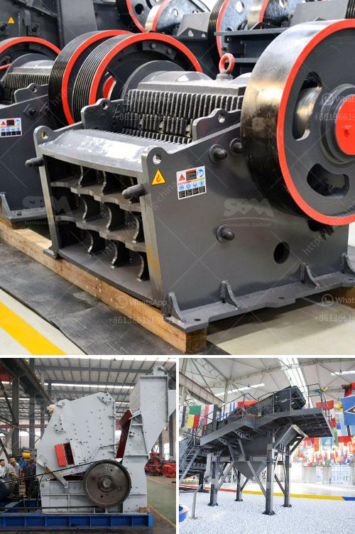

<h3>gold mining equipment nevada oregon used rock crushers</h3>
Gold mining equipment Nevada, Oregon used rock crushers are a crucial part of the mining industry and assist in the extraction of gold from deposits that might not be accessible to traditional mining methods. While gold is the most sought-after metal, there are many other valuable ores, such as silver and copper, that are also found in abundance in the region.

In the early days of gold mining, miners would use simple tools like picks and shovels to extract ore from the ground. However, as gold mining became more industrialized, the need for more advanced equipment arose. This led to the development of rock crushers, which are machines designed to crush rocks and extract valuable metals from them.

Nevada and Oregon are two states in the United States that have a rich history of gold mining. The gold rush in these regions dates back to the mid-1800s when gold was discovered in abundance. As more and more miners flocked to the area, the need for equipment like rock crushers became essential to extract gold efficiently and on a larger scale.

Rock crushers used in gold mining in Nevada, Oregon are typically powered by diesel engines or electric motors. These machines use compression to break up rocks and extract valuable metals. They work by placing the rocks between two jaws, one fixed and the other moving back and forth. As the moving jaw moves towards the fixed jaw, the rocks are crushed into smaller particles, which can then be processed further.

One common type of rock crusher used in gold mining is the jaw crusher. It is named so because of the crushing chamber resembling a jaw. This type of crusher is most commonly used for primary crushing purposes, where the ore is initially crushed into smaller pieces. The crushed material can then be processed further using other equipment like ball mills or high-pressure grinding rolls.

Another type of rock crusher commonly used in gold mining is the impact crusher. This crusher works by using impact force to crush rocks. It is particularly useful for processing medium-hard to hard rock ores. The impact crusher uses rotating hammers to strike the rocks and break them into smaller pieces.

In addition to rock crushers, other equipment used in gold mining in Nevada, Oregon includes vibrating screens, trommels, and shaking tables. These machines are used to separate the crushed ore into various sizes and extract the gold. Vibrating screens are used to separate the ore into different sizes, while trommels help to remove larger rocks and debris. Shaking tables are used to separate the gold from the rest of the crushed material, as gold is denser and heavier.

Overall, gold mining equipment like rock crushers plays a crucial role in the extraction of gold. They enable miners to extract gold efficiently and on a larger scale, increasing productivity and profitability. The use of advanced equipment has revolutionized the gold mining industry, making it possible to extract gold from deposits that would have been inaccessible in the past. As gold continues to be a valuable resource, the demand for advanced equipment like rock crushers will only continue to grow in Nevada, Oregon, and other gold-rich regions.
<h3>Contact us</h3><ul><li><strong>Whatsapp:&nbsp;<a href="https://wa.me/8613661969651">+8613661969651</a></strong></li><li><a href="https://swt.shibang-china.com/?git&amp;zhl&amp;gold mining equipment nevada oregon used rock crushers"><strong>Online Service(chat now)</strong></a></li></ul><h3>Related</h3><ul><li><a href='mining equipment tanzania.md'>mining equipment tanzania</a></li><li><a href='magnetic enrichment of manganese ore.md'>magnetic enrichment of manganese ore</a></li><li><a href='singapore handheld concrete crusher.md'>singapore handheld concrete crusher</a></li><li><a href='jaw crusher size specifications.md'>jaw crusher size specifications</a></li><li><a href='stone crusher machine for sale kenya.md'>stone crusher machine for sale kenya</a></li></ul>