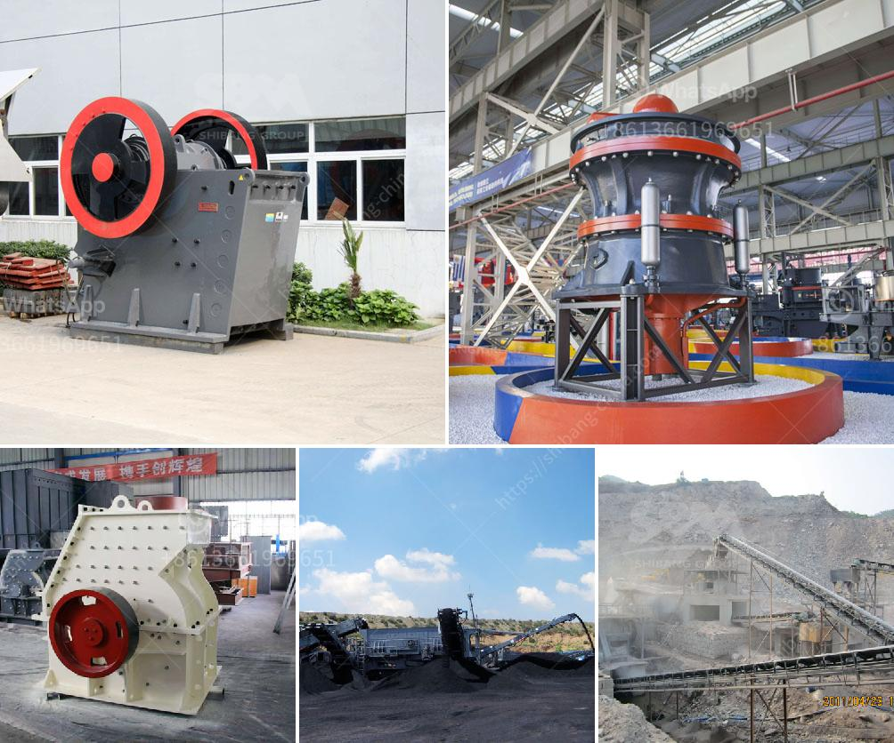

<h3>gold mining equipment pdf</h3>
Gold mining has been a popular and lucrative activity for centuries. With the increasing demand for gold and the scarcity of easily accessible deposits, many miners have turned to mechanized equipment to increase their chances of striking it rich. One such equipment that has revolutionized the way gold miners operate is the gold mining equipment in PDF.

The gold mining equipment in PDF is a new type of gravity concentration equipment developed on the basis of the traditional gold sluice. It is a modern beneficiation method with the advantages of large processing capacity and low maintenance cost.

The gold mining equipment in PDF works by utilizing the difference in density between gold and other materials in the ore. It can be widely used for the separation of gold, tin, tungsten, lead, manganese, iron, titanium, and many other minerals and ores.

One of the key components of the gold mining equipment in PDF is the vibrating sluice box, which is a kind of gravity separation equipment designed to separate gold from sand through the pulsating water flow. The vibrating sluice box is connected to the concentrator, which is used to recover gold particles that are too fine to be captured by the vibrating sluice box.

The gold mining equipment in PDF also includes other essential components, such as the feeder, the distributor, the chute, and the control system. The feeder evenly feeds the material into the vibrating sluice box, ensuring a stable and high processing capacity. The distributor evenly distributes the material on the vibrating sluice box, maximizing the separation efficiency. The chute collects the concentrate and tailings, separating them for further processing. The control system helps operators adjust the equipment parameters to achieve the desired separation results.

The gold mining equipment in PDF has many advantages over traditional gold mining methods. Firstly, it has a higher processing capacity, which means higher productivity and faster gold recovery. Secondly, it requires less maintenance compared to other equipment, reducing operating costs. Thirdly, it is more environmentally friendly because it does not use chemicals or mercury, which are harmful to the environment and human health. Additionally, the gold mining equipment in PDF is easy to install and operate, making it suitable for both experienced miners and beginners.

In conclusion, the gold mining equipment in PDF is a valuable addition to the arsenal of any gold miner. It offers increased processing capacity, low maintenance cost, and environmental friendliness. With the ability to separate gold from other materials efficiently, it provides a great opportunity for miners to maximize their profits and minimize their impact on the environment. Whether you are a seasoned miner or just starting, the gold mining equipment in PDF is worth considering for your operations.
<h3>Contact us</h3><ul><li><strong>Whatsapp:&nbsp;<a href="https://wa.me/8613661969651">+8613661969651</a></strong></li><li><a href="https://swt.shibang-china.com/?git&amp;zhl&amp;gold mining equipment pdf"><strong>Online Service(chat now)</strong></a></li></ul><h3>Related</h3><ul><li><a href='crusher machine for making sand from stone.md'>crusher machine for making sand from stone</a></li><li><a href='ball mill design calculation.md'>ball mill design calculation</a></li><li><a href='slag grinding machine.md'>slag grinding machine</a></li><li><a href='gold refining equipment machine plant.md'>gold refining equipment machine plant</a></li><li><a href='how to improve technology of mining low grade ore.md'>how to improve technology of mining low grade ore</a></li></ul>