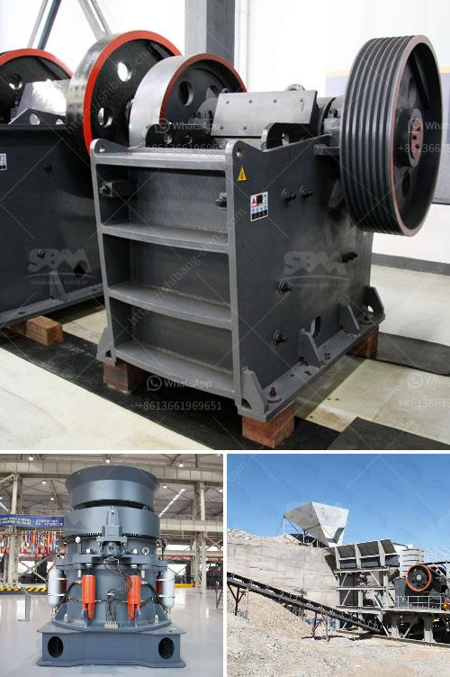

<h3>gold mining mills in south africa</h3>
Gold mining mills in South Africa historically have been fascinating endeavors. Since the earliest days of the gold rush, miners have come from around the world to dig deep into the earth and find fortune. Some have succeeded, while others have faced hardship and disappointment. Today, the country's gold mining mills continue to play a crucial role in the industry.

South Africa has a rich history when it comes to gold mining. The Witwatersrand Basin, a region stretching across Johannesburg and into Mpumalanga, holds the world's largest gold deposits. The discovery of gold in this region in the late 19th century sparked the gold rush that transformed South Africa into the economic powerhouse it is today.

Gold mining mills are crucial in the process of extracting gold from underground. They are heavy-duty machines that grind the ore into a fine powder. Once the ore is crushed, it is then mixed with water to create a slurry- a mixture of finely ground ore particles and water. This slurry is then treated with chemicals, such as cyanide, to dissolve the gold. The dissolved gold is then separated from the slurry and further processed to yield pure gold.

One of the most famous gold mining mills in South Africa is the Kloof Gold Mine, which is located in the West Rand area of Gauteng Province. It has been operational since 1952 and is one of the deepest gold mines in the world, tunneling over 3 kilometers underground. The Kloof Gold Mine is known for its challenging working conditions, as miners have to navigate through narrow tunnels and cope with high temperatures and low oxygen levels.

Another notable gold mining mill in South Africa is the Driefontein Gold Mine, which is situated in the West Witwatersrand area of Gauteng Province. Driefontein has been in operation since 1952 and is also one of the deepest gold mines in the world, with operations extending as deep as 3.4 kilometers underground. Driefontein has produced significant amounts of gold over the years and continues to be an integral part of South Africa's gold mining industry.

Gold mining mills not only contribute to South Africa's economy but also to its social fabric. The mining industry provides employment opportunities, stimulates economic growth, and supports various industries such as manufacturing and infrastructure development. It also plays a role in the development of local communities by providing infrastructure, health services, and education.

However, gold mining mills also face various challenges. The extraction process can have adverse effects on the environment, such as water pollution and the destruction of ecosystems. Additionally, mining activities can cause social issues, including displacement of communities and conflicts over land rights.

In recent years, there has been a growing focus on sustainable mining practices in South Africa's gold mining industry. Efforts are being made to minimize the environmental impact of mining operations and to ensure the well-being of local communities. This includes implementing responsible mining practices, promoting community engagement, and enforcing stringent regulations.

Despite the challenges, gold mining mills in South Africa remain vital to the economy. They continue to harness the country's rich gold deposits and contribute to employment, economic growth, and technological advancements. As the industry evolves, it is crucial to strike a balance between economic development and sustainable practices to ensure the longevity and prosperity of gold mining in South Africa.
<h3>Contact us</h3><ul><li><strong>Whatsapp:&nbsp;<a href="https://wa.me/8613661969651">+8613661969651</a></strong></li><li><a href="https://swt.shibang-china.com/?git&amp;zhl&amp;gold mining mills in south africa"><strong>Online Service(chat now)</strong></a></li></ul><h3>Related</h3><ul><li><a href='ball mill in malaysia.md'>ball mill in malaysia</a></li><li><a href='adjustement of gradation at crusher plant.md'>adjustement of gradation at crusher plant</a></li><li><a href='fine powder grinders machine.md'>fine powder grinders machine</a></li><li><a href='mobile screening and crushing.md'>mobile screening and crushing</a></li><li><a href='barite ore processing equipment rent and sale.md'>barite ore processing equipment rent and sale</a></li></ul>