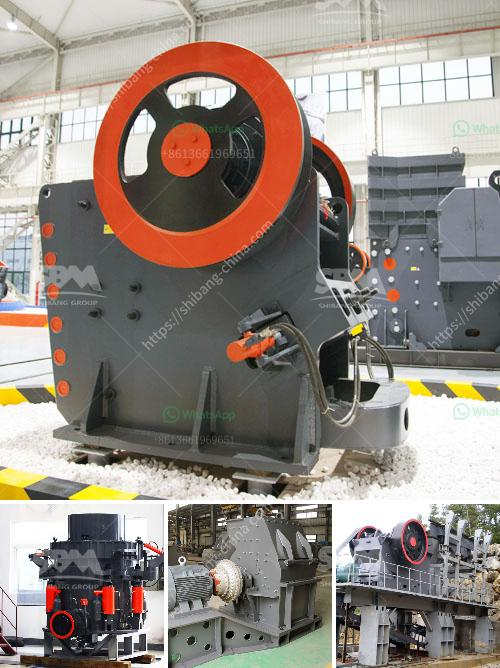

<h3>gold ore processing equipment manufacturer india</h3>
Gold mining, undoubtedly, has been one of the most sought-after and lucrative industries across the globe. This precious metal has not only been used for crafting exquisite jewelry but has also played a pivotal role in the economy. India, in particular, has witnessed significant growth in its gold mining activities, making it a key player in the global market. And to ensure effective and efficient extraction and processing of gold ore, the role of gold ore processing equipment manufacturers becomes equally important.

India is blessed with abundant gold ore deposits, scattered across different regions. To convert these resources into valuable assets, mining companies rely on specialized equipment. These equipment manufacturers are responsible for designing, manufacturing, and supplying the necessary machinery and technology required for gold ore processing.

One such prominent player in the Indian gold ore processing industry is ABC Mining Equipment Pvt. Ltd. With over three decades of experience in the field, ABC Mining Equipment Pvt. Ltd. has established itself as a leading manufacturer, exporter, and supplier of a wide range of gold processing equipment. The company is headquartered in Delhi, with state-of-the-art manufacturing facilities located in different parts of the country.

What sets ABC Mining Equipment Pvt. Ltd. apart from its competitors is their commitment to innovation and quality. The company constantly invests in research and development to design and manufacture advanced gold ore processing equipment. Their product range includes crushers, mills, concentrators, smelters, and other customized machinery required for efficient gold extraction.

Furthermore, ABC Mining Equipment Pvt. Ltd. is known for its focus on sustainability. They embrace eco-friendly practices by adopting energy-efficient technologies and minimizing water consumption during the processing stage. The company also ensures the safe disposal of waste and uses recycled materials wherever possible, thus minimizing their environmental impact.

Another notable feature of ABC Mining Equipment Pvt. Ltd. is their dedicated after-sales support. Their team of experienced technicians provides installation, training, and maintenance services to ensure optimal performance of the equipment. This commitment to customer satisfaction has earned them a loyal clientele not only in India but also in international markets.

In conclusion, gold ore processing equipment manufacturers in India play a crucial role in the success of the country's gold mining industry. Companies like ABC Mining Equipment Pvt. Ltd. have emerged as pioneers in this field, providing innovative and high-quality machinery for efficient extraction and processing of gold ore. With their focus on sustainability and dedication to customer satisfaction, these manufacturers are paving the way for a prosperous and environmentally conscious future of gold mining in India.
<h3>Contact us</h3><ul><li><strong>Whatsapp:&nbsp;<a href="https://wa.me/8613661969651">+8613661969651</a></strong></li><li><a href="https://swt.shibang-china.com/?git&amp;zhl&amp;gold ore processing equipment manufacturer india"><strong>Online Service(chat now)</strong></a></li></ul><h3>Related</h3><ul><li><a href='mobile crusher unit.md'>mobile crusher unit</a></li><li><a href='machine that to crush rock.md'>machine that to crush rock</a></li><li><a href='grinding milling equipment in south africa.md'>grinding milling equipment in south africa</a></li><li><a href='calcium processing plant.md'>calcium processing plant</a></li><li><a href='portable hand powered rock crushers zambia.md'>portable hand powered rock crushers zambia</a></li></ul>