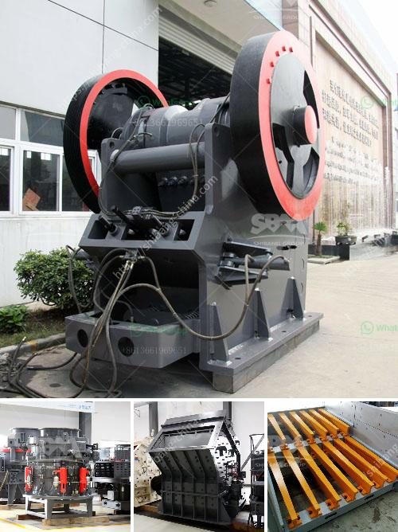

<h3>gold ore rock processing equipment price</h3>
Gold ore rock processing equipment is widely used in gold ore mining plant, producing about 50-500 tons per hour of gold-bearing rock. The processing equipment includes jaw crusher, impact crusher, cone crusher, ball mill, classifier, flotation machine, magnetic separator, and dryer, among others. Each of these machines is suitable for different stages of gold ore processing.

The first stage of gold ore rock processing is the crushing process. The jaw crusher and impact crusher are the primary crushers used to break down the large pieces of rock into smaller particles. These smaller particles are then fed into the ball mill for further grinding.

In the second stage, the crushed rock particles are transported to the classifier. The classifier is responsible for separating the particles based on size. This step ensures that only the appropriate-sized particles proceed to the next stage of processing.

The third stage involves the flotation process. This is where the gold particles are separated from other minerals and impurities. The flotation machine uses chemicals and agitation to separate the gold from the remaining rock.

Once the gold particles are separated, they are then sent to the magnetic separator. The magnetic separator removes any remaining impurities and further purifies the gold particles.

Finally, the gold particles are dried using a dryer. This step ensures that the gold is completely dry and ready for further processing or sale.

The price of the gold ore rock processing equipment varies depending on the specific machine and its capacity. Generally, the price ranges from $5000 to $300000. It is important to note that the cost may also include installation, maintenance, and operating expenses.

There are several factors to consider when determining the price of gold ore rock processing equipment. The first is the size and capacity of the equipment. Larger machines with higher capacity typically have a higher price tag.

Another factor to consider is the brand and reputation of the manufacturer. Well-known and reputable manufacturers often charge a premium for their equipment due to their high-quality and reliability. However, it is important to do some research and read reviews to ensure that the chosen equipment meets the specific requirements of the mining operation.

Additionally, the price can also be influenced by the specific features and functionality of the equipment. Some machines may include advanced technology or additional features to improve efficiency and productivity, which can drive up the price.

In conclusion, gold ore rock processing equipment plays a crucial role in extracting gold from the ore. The process involves several stages, including crushing, grinding, classification, flotation, magnetic separation, and drying. The price of the equipment depends on various factors such as size, capacity, brand, and specific features. It is important for mining operations to carefully assess their needs and budget before investing in gold ore rock processing equipment.
<h3>Contact us</h3><ul><li><strong>Whatsapp:&nbsp;<a href="https://wa.me/8613661969651">+8613661969651</a></strong></li><li><a href="https://swt.shibang-china.com/?git&amp;zhl&amp;gold ore rock processing equipment price"><strong>Online Service(chat now)</strong></a></li></ul><h3>Related</h3><ul><li><a href='5 ton per hour mobile gold process mill.md'>5 ton per hour mobile gold process mill</a></li><li><a href='basalt crushing processing.md'>basalt crushing processing</a></li><li><a href='lime stone crusher machine manufacturing company china.md'>lime stone crusher machine manufacturing company china</a></li><li><a href='model of crusher and steps of constructions.md'>model of crusher and steps of constructions</a></li><li><a href='quarry crusher for sale.md'>quarry crusher for sale</a></li></ul>