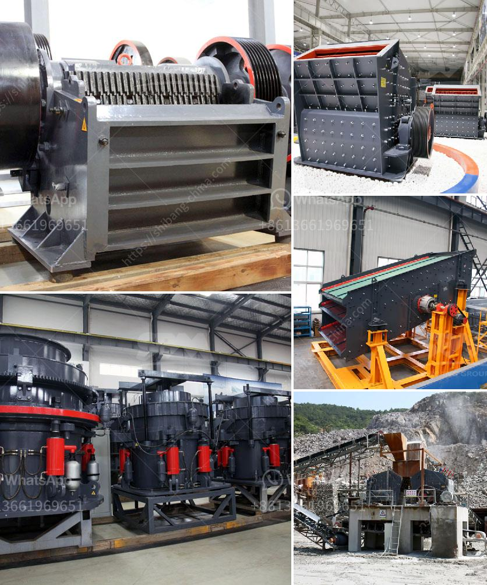

<h3>gold processing equipment</h3>
Gold processing equipment refers to the machinery and tools used to extract gold from its ore. While gold can only be mined from gold-rich deposits, converting it into usable material is a complex and time-consuming process. To achieve this, specialized gold processing equipment is required.

One of the main methods used to extract gold is the cyanide process, which involves treating the ore with a solution of cyanide. This process not only extracts gold, but it also separates it from other minerals and impurities. To carry out the cyanide process, several pieces of equipment are required.

The first essential equipment for gold processing is a crusher. This machine breaks the large chunks of ore into smaller, more manageable pieces. The ore is then fed into a ball mill, where it is further ground into a fine powder. The powdered ore is then mixed with water and a weak cyanide solution in large tanks, known as leaching tanks.

Next in line is the agitation equipment. This equipment keeps the mixture in motion, ensuring thorough mixing of the cyanide solution with the ore particles. Agitation tanks can come in various sizes and designs, depending on the volume of ore being treated.

Once the ore has been thoroughly mixed, it is pumped into a series of gold recovery tanks. These tanks contain activated carbon, which acts as a sponge and absorbs the dissolved gold from the cyanide solution. The gold-laden carbon is then separated from the remaining solution and washed to remove any remaining impurities.

The final step in the gold processing process is the smelting of gold. This involves melting the gold into a molten state using high temperatures. Smelting transforms the gold into a more pure form and removes any remaining impurities. The molten gold is then poured into molds to create gold bars or other desired shapes.

In addition to the cyanide process, there are other methods used to extract gold, such as gravity separation and flotation. These methods rely on the differences in density or physical properties of gold and other minerals. Equipment used for these processes may include gravity concentrators, shaking tables, and flotation cells.

Gold processing equipment can vary greatly in terms of size, capacity, and efficiency. Larger operations may require heavy machinery, such as excavators and bulldozers, to extract and transport the ore. Smaller operations may use smaller, portable equipment that can be easily transported to different mining sites.

It is essential for gold processing equipment to be durable, reliable, and efficient. The extraction and processing of gold can be a costly endeavor, so equipment must be able to handle high volumes of ore and operate for extended periods without breakdowns or maintenance issues. Additionally, equipment should be designed to minimize environmental impact and adhere to strict safety regulations.

In conclusion, gold processing equipment plays a crucial role in extracting and refining gold from its ore. It enables mining companies to efficiently transform raw ore into usable gold while ensuring minimal loss and environmental impact. From crushers and ball mills to leaching tanks and smelting furnaces, each piece of equipment is vital for the successful extraction of gold.
<h3>Contact us</h3><ul><li><strong>Whatsapp:&nbsp;<a href="https://wa.me/8613661969651">+8613661969651</a></strong></li><li><a href="https://swt.shibang-china.com/?git&amp;zhl&amp;gold processing equipment"><strong>Online Service(chat now)</strong></a></li></ul><h3>Related</h3><ul><li><a href='lum vertical mill.md'>lum vertical mill</a></li><li><a href='stone crushing plant electro plants.md'>stone crushing plant electro plants</a></li><li><a href='feldspar crusher machine.md'>feldspar crusher machine</a></li><li><a href='business plan for small mining processing plant.md'>business plan for small mining processing plant</a></li><li><a href='coal crusher suppliers.md'>coal crusher suppliers</a></li></ul>