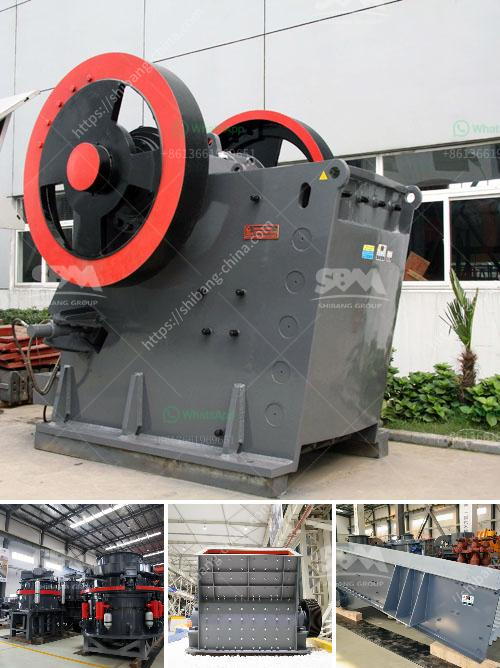

<h3>gold processing in philippines</h3>
Gold has been a valuable metal for centuries, treasured for its beauty and rarity. In the Philippines, gold mining has a long history dating back to the 16th century, when Spanish explorers discovered deposits in what is now known as the province of Surigao del Norte. Today, gold processing plays a vital role in the country's economy, providing livelihoods for thousands of Filipinos and contributing to national income.

The process of extracting gold from ore involves various methods, depending on the type of deposit and the scale of mining operations. In the Philippines, there are two main types of gold deposits: placer and lode. Placer deposits are found in riverbeds and beaches, where gold particles have been eroded from their original source and accumulated over time. Lode deposits, on the other hand, are found in veins or mineralized zones within rocks.

To extract gold from placer deposits, miners use simple tools such as pans, sluice boxes, and shovels. They scoop the sediment from riverbeds or beaches into pans and swirl the contents, allowing the heavier gold particles to settle at the bottom. Sluice boxes are used for larger-scale operations, where water and gravity are used to separate gold from the sediment. This traditional method of gold panning has been practiced for generations and is still employed by small-scale miners in the Philippines.

For lode deposits, more complex methods are required. Underground mining is often employed, where tunnels are dug to reach the gold-bearing veins. Miners use explosives to break up the rock, which is then hauled to the surface for processing. Crushing and grinding the ore into fine particles is the next step, followed by various methods of gold extraction.

One common method is cyanidation, where the ore is mixed with a weak cyanide solution to dissolve the gold. The resulting solution, known as slurry, is then treated with activated carbon to adsorb the gold particles. The carbon is then separated from the slurry, and the gold is recovered by heating the carbon to remove the gold. This method, known as carbon-in-pulp (CIP) processing, is widely used in large-scale mining operations in the Philippines.

Another method is the use of mercury, which forms an amalgam with gold. The ore is crushed and milled, and the resulting powder is mixed with mercury. The gold particles form an amalgam with the mercury, which is then heated to evaporate the mercury, leaving behind the gold. However, the use of mercury is highly toxic and poses significant risks to human health and the environment.

In recent years, the Philippine government has been implementing stricter regulations on gold processing to address the environmental and health concerns associated with the industry. Small-scale miners are required to obtain permits and comply with safety and environmental standards. Efforts are also being made to promote responsible mining practices and provide support for small-scale miners to transition to safer and more sustainable methods.

Gold processing in the Philippines has a long and rich history, contributing to the country's economy and providing livelihoods for many Filipinos. However, it is important to ensure that gold mining is conducted in a responsible and sustainable manner, balancing economic benefits with environmental protection and the well-being of local communities.
<h3>Contact us</h3><ul><li><strong>Whatsapp:&nbsp;<a href="https://wa.me/8613661969651">+8613661969651</a></strong></li><li><a href="https://swt.shibang-china.com/?git&amp;zhl&amp;gold processing in philippines"><strong>Online Service(chat now)</strong></a></li></ul><h3>Related</h3><ul><li><a href='but concrete crushers nigeria.md'>but concrete crushers nigeria</a></li><li><a href='density of balls for mills.md'>density of balls for mills</a></li><li><a href='crusher manufacturers in germany.md'>crusher manufacturers in germany</a></li><li><a href='limestone and dolomite crusher plant.md'>limestone and dolomite crusher plant</a></li><li><a href='300kg to 500kg ball mill.md'>300kg to 500kg ball mill</a></li></ul>