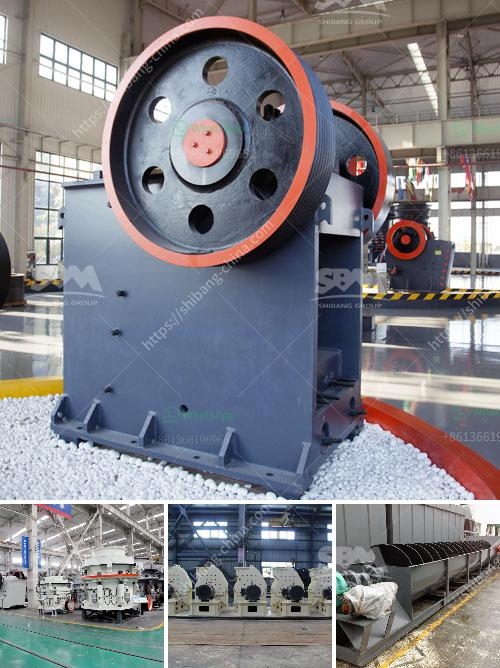

<h3>gold processing methods iron slag</h3>
Gold processing methods for iron slag have been used throughout history to extract and refine gold. Iron slag, which is a byproduct of iron production, contains traces of gold and other precious metals. These methods have evolved over time and utilize various techniques to separate gold from the slag. In this article, we will explore some of the common gold processing methods used for iron slag.

One of the most ancient gold processing methods is panning. Panning involves using a shallow pan or metal sieve to wash the slag and separate the heavier gold particles. By swirling the mixture and allowing the water to carry away the lighter materials, the denser gold particles eventually settle at the bottom. Panning is a simple and low-cost method that has been used for centuries and is still widely used today in many parts of the world, including artisanal gold mining operations.

Another common gold processing method is gravity concentration. This technique relies on the difference in density between gold and other minerals present in the slag. Gravity concentration involves using gravity-based equipment, such as sluice boxes or jigs, to separate gold particles from the lighter gangue minerals. By utilizing the force of gravity, the heavier gold particles are collected while the lighter materials are washed away. Gravity concentration is relatively simple and effective, making it a popular choice for gold recovery from iron slag.

In more modern gold processing methods, chemical processes are often used to extract gold from iron slag. One such method is cyanidation, which involves treating the slag with a weak cyanide solution to dissolve the gold. The gold-cyanide complex is then separated from the rest of the slag and collected for further purification. Cyanidation is a complex and highly regulated process due to its potential environmental impacts, but it is widely used in large-scale gold mines around the world.

Another chemical process used for gold extraction from iron slag is amalgamation. Amalgamation involves mixing the slag with mercury, which forms an amalgam with gold. The amalgam is then heated to vaporize the mercury and leave behind the gold. This method has been used for centuries and is still used today in certain regions, particularly where access to modern technology and equipment is limited.

In conclusion, gold processing methods for iron slag have evolved over time and vary depending on the scale of operation and available resources. Traditional methods such as panning and gravity concentration are still widely used, while modern techniques like cyanidation and amalgamation are employed in larger, industrial-scale operations. As with any mining activity, it is important to consider the potential environmental impacts and ensure proper management of waste materials to minimize the release of harmful substances.
<h3>Contact us</h3><ul><li><strong>Whatsapp:&nbsp;<a href="https://wa.me/8613661969651">+8613661969651</a></strong></li><li><a href="https://swt.shibang-china.com/?git&amp;zhl&amp;gold processing methods iron slag"><strong>Online Service(chat now)</strong></a></li></ul><h3>Related</h3><ul><li><a href='hp 300 cone crusher.md'>hp 300 cone crusher</a></li><li><a href='business plan for crushing and screening.md'>business plan for crushing and screening</a></li><li><a href='granite crushing plant in sri lanka.md'>granite crushing plant in sri lanka</a></li><li><a href='copper crusher for sale in malaysia.md'>copper crusher for sale in malaysia</a></li><li><a href='stone crusher rent based mobile machine.md'>stone crusher rent based mobile machine</a></li></ul>