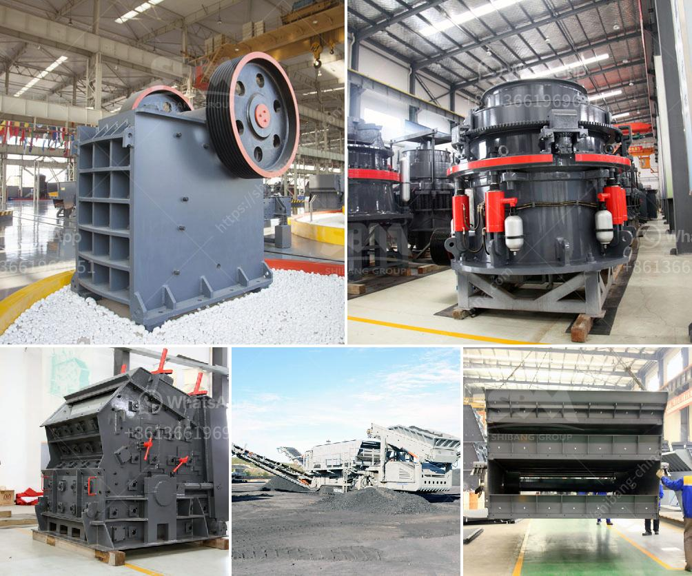

<h3>gold refining equipment machine plant</h3>
Gold refining has been a practice for centuries, with its origins dating back to ancient civilizations. The process involves extracting impurities from gold to create pure bars or pieces that are ready to be sold and used in various industries. To carry out this precise task, gold refining equipment machine plants are used.

A gold refining equipment machine plant is specially designed and fabricated to extract the impurities present in base metal, such as gold, using chemical procedures and technological operations. These processes primarily include the use of heat, acids, and electrolysis methods to separate and extract the pure gold from the impurities present.

One of the essential components of a gold refining equipment machine plant is the furnace. A furnace uses high temperatures to melt the impure gold, allowing separation from other metals and impurities. The refined gold is then cast into molds to produce bars or any desired shape.

Another crucial component is the chemical process. This process involves the use of various chemicals such as nitric acid, hydrochloric acid, and aqua regia, which act as powerful solvents to dissolve the impurities. These chemicals react selectively with different metals, ensuring that only gold remains in the final solution. Subsequent filtrations and precipitations are performed to separate the pure gold from the solution.

Electrolysis is also a highly important process in gold refining equipment machine plants. It involves the passing of an electric current through a gold-filled solution, causing the pure gold to plate out onto a cathode. This process ensures the removal of any remaining impurities and provides a highly refined end product.

A well-designed gold refining equipment machine plant should be able to precisely control the entire refining process without causing any harm to the environment. The equipment should also be efficient and cost-effective while being able to produce high-quality gold bars.

When searching for a gold refining equipment machine plant, several factors need to be considered. The capacity of the plant should match the requirements of the business or individual. Some plants can handle small volumes, while others are designed for large-scale refineries. It is important to choose the plant that aligns with the refining goals and expected output.

Additionally, the equipment should be reliable and easy to maintain. Look for machines that are robustly constructed and made from high-quality materials. The components should be easy to clean and replace, ensuring smooth operations and reducing downtime.

Safety features should not be overlooked when selecting a gold refining equipment machine plant. The equipment should have built-in safety systems to prevent accidents and protect operators. Safety measures may include emergency shutdown switches, fume extraction systems, and proper ventilation to deal with potentially harmful gases and chemicals.

In conclusion, a gold refining equipment machine plant is an indispensable tool for refining impurities from gold to create pure bars or pieces. The process involves the use of furnaces, chemical procedures, and electrolysis methods to achieve highly refined gold. When selecting a plant, one should consider factors such as capacity, efficiency, maintenance requirements, and safety features. With the right equipment, a gold refining business can thrive, serving industries that require pure gold for various applications.
<h3>Contact us</h3><ul><li><strong>Whatsapp:&nbsp;<a href="https://wa.me/8613661969651">+8613661969651</a></strong></li><li><a href="https://swt.shibang-china.com/?git&amp;zhl&amp;gold refining equipment machine plant"><strong>Online Service(chat now)</strong></a></li></ul><h3>Related</h3><ul><li><a href='crushing stone machines for sale in usa.md'>crushing stone machines for sale in usa</a></li><li><a href='stone crusher in pakistan.md'>stone crusher in pakistan</a></li><li><a href='china cement grinding unit manufacturers.md'>china cement grinding unit manufacturers</a></li><li><a href='rock crushing equipment to make stone dust.md'>rock crushing equipment to make stone dust</a></li><li><a href='450 tph limestone crusher.md'>450 tph limestone crusher</a></li></ul>