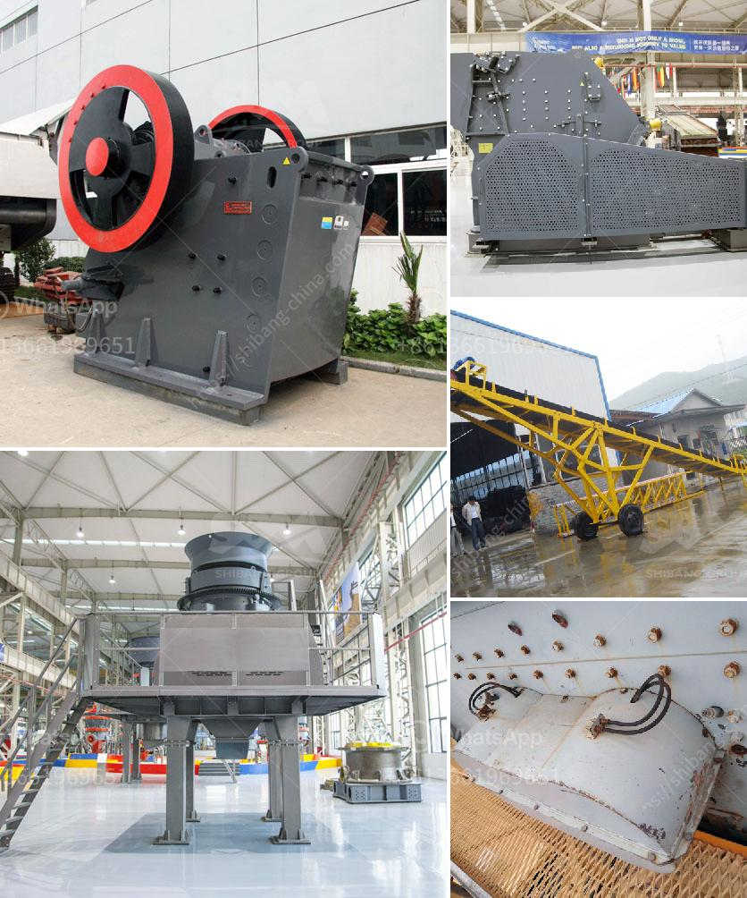

<h3>gold stamp mill manufacturer in china</h3>
The gold stamp mill is a type of mill machine that crushes material by pounding rather than grinding, either for further processing or for extraction of gold. In China, it is widely used in the mining industry, as well as for construction and ore processing.

There are many manufacturers that sell gold stamp mills in China, but ones that stand out are those that offer exceptional quality and reliability to ensure optimal performance. This article will highlight some of the top gold stamp mill manufacturers in China.

One of the leading manufacturers of gold stamp mills in China is Henan Hongxing Mining Machinery Co., Ltd. Located in Zhengzhou, Henan Province, this company has been in operation since 1980. With more than 40 years of experience in mining machinery, they have successfully provided various types of gold stamp mills to customers all over the world. Their stamp mills are known for their high efficiency, low energy consumption, and low operation and maintenance costs.

Another reputable manufacturer is Zhengzhou Unique Industrial Equipment Co., Ltd. Established in 1982, this company specializes in the production of mining machinery, including gold stamp mills. They have a team of highly skilled engineers and technicians who are committed to delivering superior products to their customers. Their stamp mills are designed with cutting-edge technology to ensure efficient gold extraction and processing.

Shanghai Shibang Machinery Co., Ltd. is also a prominent gold stamp mill manufacturer in China. Founded in 1987, this manufacturer strives to provide advanced technology solutions for mining and construction industries worldwide. With their stamp mills, they aim to maximize gold recovery rates while minimizing environmental impact. Shanghai Shibang Machinery Co., Ltd. is known for its professionalism, excellent after-sales service, and commitment to customer satisfaction.

Jiangxi Hengchang Mining Machinery Manufacturing Co., Ltd. is a reliable gold stamp mill manufacturer that has been in operation for over 30 years. Based in Ganzhou, Jiangxi Province, this company has gained a strong reputation for producing high-quality stamp mills. They focus on research and development to improve the performance and reliability of their equipment. Jiangxi Hengchang Mining Machinery Manufacturing Co., Ltd. is dedicated to providing customers with efficient and cost-effective solutions for gold processing.

In conclusion, the gold stamp mill is an essential piece of equipment in the mining industry, particularly in the extraction of gold. China has several manufacturers that produce high-quality stamp mills to meet the needs of customers. Henan Hongxing Mining Machinery Co., Ltd., Zhengzhou Unique Industrial Equipment Co., Ltd., Shanghai Shibang Machinery Co., Ltd., and Jiangxi Hengchang Mining Machinery Manufacturing Co., Ltd. are among the top manufacturers in China. These companies strive to deliver reliable and efficient stamp mills to maximize gold extraction and processing while maintaining environmental sustainability.
<h3>Contact us</h3><ul><li><strong>Whatsapp:&nbsp;<a href="https://wa.me/8613661969651">+8613661969651</a></strong></li><li><a href="https://swt.shibang-china.com/?git&amp;zhl&amp;gold stamp mill manufacturer in china"><strong>Online Service(chat now)</strong></a></li></ul><h3>Related</h3><ul><li><a href='adjustement of gradation at crusher plant.md'>adjustement of gradation at crusher plant</a></li><li><a href='gold processing in philippines.md'>gold processing in philippines</a></li><li><a href='cost or operating stone quarry and crusher.md'>cost or operating stone quarry and crusher</a></li><li><a href='roll crusher for various size coal.md'>roll crusher for various size coal</a></li><li><a href='stone crusher plant kyc.md'>stone crusher plant kyc</a></li></ul>