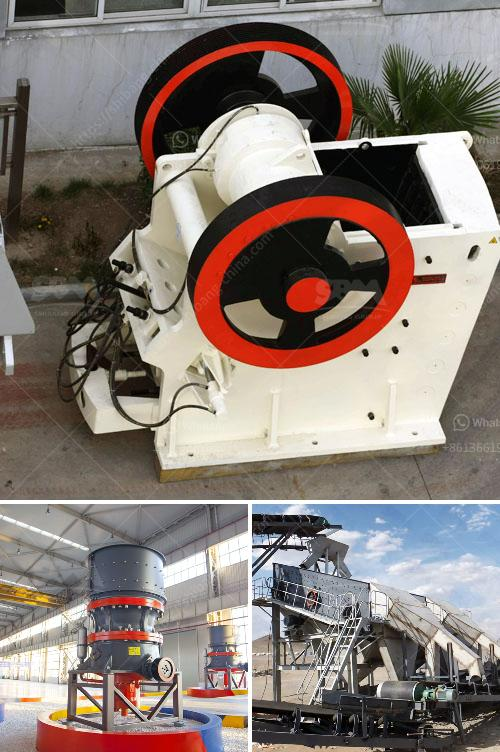

<h3>gold stamp mills in zimbabwe</h3>
The gold stamp mill is a term used to describe the grinding machines that were used to extract gold ore. The stamp mill was a mechanical device used to separate gold from rocks. It was widely used in mining in Zimbabwe during the 19th and 20th centuries.

The stamp mill consisted of a series of heavy metal stamps arranged in a wooden frame. The stamps were lifted and dropped onto the ore, crushing it into small particles. The crushed ore was then washed over copper plates coated with mercury. As gold is known to bind with mercury, the mercury would capture small gold particles, forming an amalgam.

The stamp mill revolutionized gold mining in Zimbabwe by facilitating the extraction of gold from large deposits of low-grade ore. The stamps can process up to 2.5 tons of ore per day, which significantly increases the production of gold. The stamp mill also increases the value of gold ore as it can process lower-grade gold deposits, making them economically viable to mine.

The introduction of stamp mills in Zimbabwe also provided much-needed employment opportunities for local communities. The stamp mills required a skilled workforce to operate and maintain them, creating jobs for both men and women. The gold mining industry quickly became one of the main sources of employment in Zimbabwe, contributing to the growth and development of the economy.

The stamp mills played a critical role in the development of mining in Zimbabwe. They were widely used in gold extraction and processing operations across the country. The stamp mill played a significant role in gold mining operations in both small-scale and large-scale mining sites.

Despite the technological advancements in mining equipment, there are still several stamp mills present in Zimbabwe today. Some of these stamp mills have been preserved as historical sites, allowing visitors to experience the machinery that was instrumental in shaping the country's mining industry.

However, the introduction of modern mining techniques and equipment has made stamp mills less economically viable. Many have been replaced with more efficient and cost-effective technologies such as ball mills and cyanidation. Nevertheless, the legacy of stamp mills in Zimbabwe remains significant, and they continue to be an important part of the country's mining history.

In conclusion, gold stamp mills played a crucial role in mining operations in Zimbabwe. They were instrumental in extracting gold from low-grade ore, increasing production, and providing employment opportunities. Although their significance has decreased with the advancement of mining technology, their legacy is still cherished as an integral part of Zimbabwe's mining history.
<h3>Contact us</h3><ul><li><strong>Whatsapp:&nbsp;<a href="https://wa.me/8613661969651">+8613661969651</a></strong></li><li><a href="https://swt.shibang-china.com/?git&amp;zhl&amp;gold stamp mills in zimbabwe"><strong>Online Service(chat now)</strong></a></li></ul><h3>Related</h3><ul><li><a href='cost of granite crushing equipment.md'>cost of granite crushing equipment</a></li><li><a href='manganese washing equipment cost.md'>manganese washing equipment cost</a></li><li><a href='types of ball mills.md'>types of ball mills</a></li><li><a href='ultra fine dry grinding mill.md'>ultra fine dry grinding mill</a></li><li><a href='used crushing quarry plant in south africa.md'>used crushing quarry plant in south africa</a></li></ul>