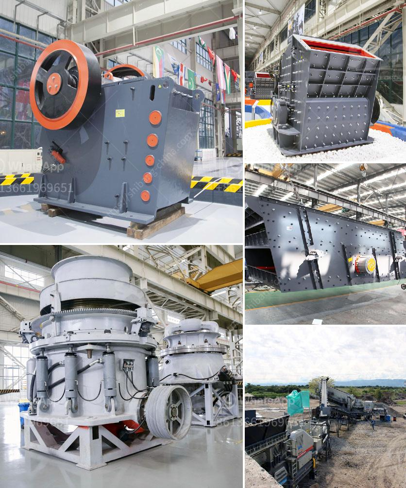

<h3>granite crusher manufacturer</h3>
Granite is a common and widely occurring type of igneous rock. It is formed from the slow crystallization of magma below Earth's surface. Granite derives its name from the Latin word "granum," meaning grain, referring to the rock's coarse-grained structure.

Granite has a variety of uses due to its durability and aesthetic appeal. It is often used as a material for countertops, flooring, and monuments. To transform granite into various finished products, it requires the use of specialized equipment. This is where a granite crusher manufacturer comes into play.

A granite crusher is a key piece of equipment that can blast through even the hardest of materials with ease. Granite crushers are specifically designed to handle and process granite, ensuring optimal efficiency and performance. These crushers utilize strong and durable parts, making them long-lasting and reliable machines.

There are several benefits to using a granite crusher manufactured by a reputable company. Firstly, the quality of the crusher itself is usually top-notch. Established manufacturers use high-quality materials and state-of-the-art technology to produce crushers that meet industry standards. This ensures that the crushers are robust, reliable, and can withstand the demands of crushing granite.

Additionally, granite crusher manufacturers often offer a range of models and sizes, allowing customers to choose the right crusher for their specific needs. Whether it's a small-scale residential project or a large commercial endeavor, there is a granite crusher suitable for every application. This versatility ensures that customers can find a crusher that meets their requirements precisely.

Furthermore, granite crusher manufacturers typically provide comprehensive after-sales services. This can include technical support, spare parts availability, and maintenance assistance. Choosing a reputable manufacturer ensures that you have access to these services should any issues arise with your crusher. This support contributes to the long-term reliability and performance of the crusher, giving customers peace of mind.

When selecting a granite crusher manufacturer, it is crucial to consider factors such as reputation, experience, and customer reviews. A well-established manufacturer with a track record of delivering high-quality products should be prioritized. Reading customer reviews and testimonials can provide valuable insights into the manufacturer's reputation and the satisfaction of previous customers.

In conclusion, a granite crusher manufacturer plays a vital role in the granite industry. Their crushers are designed to efficiently process granite, providing the necessary equipment to transform raw granite into finished products. By choosing a reputable manufacturer, customers can benefit from high-quality crushers, a variety of models to choose from, and comprehensive after-sales services. Whether it's for residential or commercial use, a granite crusher from a trusted manufacturer is a reliable investment that ensures optimal performance and durability.
<h3>Contact us</h3><ul><li><strong>Whatsapp:&nbsp;<a href="https://wa.me/8613661969651">+8613661969651</a></strong></li><li><a href="https://swt.shibang-china.com/?git&amp;zhl&amp;granite crusher manufacturer"><strong>Online Service(chat now)</strong></a></li></ul><h3>Related</h3><ul><li><a href='jaw crusher price list 150 x 200mm.md'>jaw crusher price list 150 x 200mm</a></li><li><a href='crushing plants in malaysia.md'>crushing plants in malaysia</a></li><li><a href='ball milling method.md'>ball milling method</a></li><li><a href='ball mill for silica grinding made in japan.md'>ball mill for silica grinding made in japan</a></li><li><a href='to see models of vibrating screens.md'>to see models of vibrating screens</a></li></ul>