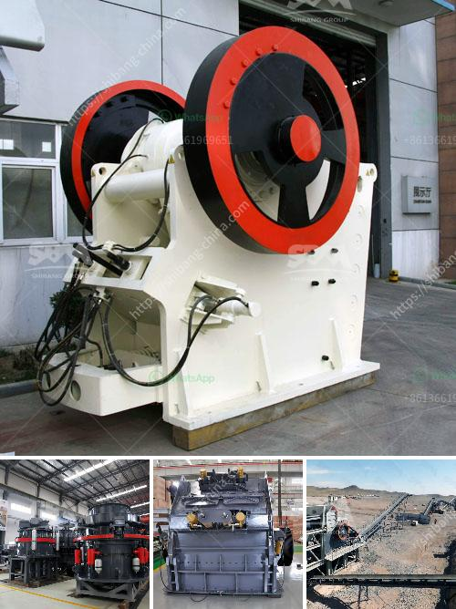

<h3>granite crusher south africa</h3>
Granite is a common and widely occurring type of intrusive, felsic, igneous rock. Granites are usually medium to coarsely crystalline, occasionally with some individual crystals larger than the groundmass forming a rock known as porphyry. Granites can be pink to gray in color, depending on their chemistry and mineralogy. Granites are used in a variety of construction projects, including countertops, flooring, and monuments.

In South Africa, granite mining is a major industry. For many years, South Africa has been a leading exporter of granite to countries around the world. This beautiful natural stone is known for its durability and strength. Granite is a sustainable material, making it an eco-friendly choice for countertops and other applications.

One of the key players in the South African granite industry is Granite Crushers. This company produces and sells granite slabs for the international market. The company has been in business for over 10 years and has developed a reputation for quality, consistency, and reliability.

Granite Crushers operates several quarries and mines in the Gauteng province of South Africa. The company produces a wide range of granite products, including slabs, tiles, and monuments. In addition, Granite Crushers has a professional team of geologists, engineers, and miners who work together to ensure that the mining process is conducted in a safe and responsible manner.

One of the main advantages of granite mining in South Africa is the abundance of raw material. The country has a vast resource of granite, with deposits located throughout the country. This makes it easy for Granite Crushers to access high-quality granite for their products. The company has invested in state-of-the-art machinery and equipment to extract the granite efficiently and with minimal environmental impact.

Granite Crushers is committed to sustainable mining practices. The company follows strict environmental policies to minimize its impact on the surrounding ecosystem. This includes measures such as reforestation, soil conservation, and proper waste management. The company also ensures that its employees are trained in safe mining practices to protect their health and well-being.

In addition to its commitment to sustainability, Granite Crushers is also dedicated to supporting local communities. The company provides employment opportunities to local residents, helping to stimulate the local economy. It also invests in community development projects, such as schools, healthcare facilities, and infrastructure.

The granite industry in South Africa, including Granite Crushers, has faced some challenges in recent years. Economic downturns and fluctuations in global demand have affected the industry's profitability. However, the South African government is actively working to support the industry and attract investments. This includes offering tax incentives and providing funding for research and development.

Despite these challenges, the future looks promising for the granite industry in South Africa. The country's rich resource of granite, combined with its commitment to sustainable mining practices, makes it a competitive player in the global market. With companies like Granite Crushers leading the way, South Africa is well-positioned to continue supplying high-quality granite to the world.

In conclusion, Granite Crushers is a leading player in the granite industry in South Africa. The company's commitment to sustainability and community development, combined with its access to high-quality raw material, has positioned it as a key supplier in the global market. As the demand for granite continues to grow, South Africa will continue to play a vital role in meeting that demand.
<h3>Contact us</h3><ul><li><strong>Whatsapp:&nbsp;<a href="https://wa.me/8613661969651">+8613661969651</a></strong></li><li><a href="https://swt.shibang-china.com/?git&amp;zhl&amp;granite crusher south africa"><strong>Online Service(chat now)</strong></a></li></ul><h3>Related</h3><ul><li><a href='stone crusher plan dwg.md'>stone crusher plan dwg</a></li><li><a href='formula de capacidad de chancadora.md'>formula de capacidad de chancadora</a></li><li><a href='working cone crushers.md'>working cone crushers</a></li><li><a href='vibrating screen for 150 microns.md'>vibrating screen for 150 microns</a></li><li><a href='crushing plants pawer screen.md'>crushing plants pawer screen</a></li></ul>