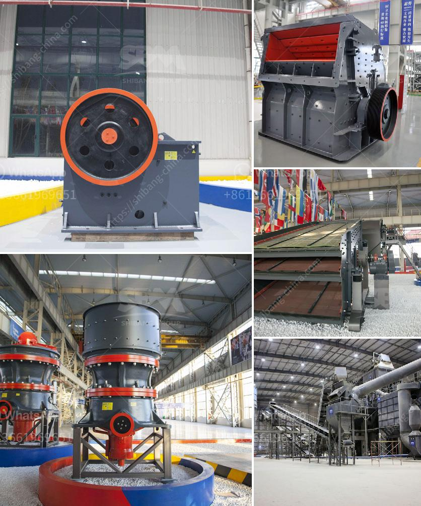

<h3>granite crushers and screeners</h3>
Granite is a common and widely occurring type of intrusive, felsic, igneous rock. In recent years, the demand for granite aggregates has skyrocketed due to their durability, beauty, and versatility in various construction projects. To meet this escalating demand, granite crushers and screeners have become essential resources for granite processing and recycling.

Granite crushers are heavy-duty machines that can effortlessly break down granite into different sizes. These crushers utilize a variety of mechanical actions to conquer the rock, including impact, compression, and attrition. Depending on the desired final product size, the appropriate crusher type can vary from jaw crushers, cone crushers, to impact crushers. They efficiently reduce granite rocks into smaller pieces, making them suitable for specific applications such as road bases, concrete aggregates, and railroad ballast.

Meanwhile, granite screeners work in tandem with crushers to separate the crushed granite into various sizes. These screeners use multiple screens of different mesh sizes to categorize the crushed granite particles accurately. The screens vibrate, allowing smaller particles to pass through while ensuring larger pieces are properly sorted. This segregation ensures optimal use of the granite material and simplifies the subsequent processes by providing consistent-sized granite aggregates.

The use of granite crushers and screeners has several advantages. Firstly, they enhance the mining process, making it more efficient and productive. The crushers and screeners expedite the initial breaking and sorting, saving valuable time and resources. Additionally, the specialized machinery ensures proper sizing, resulting in high-quality granite aggregates.

Secondly, granite crushers and screeners contribute to environmental sustainability. By recycling leftover granite waste from construction sites or repurposing old granite structures, these machines prevent the waste from ending up in landfills. Instead, the granite can be crushed, screened, and transformed into valuable resources, reducing the need for virgin materials and conserving natural resources.

In conclusion, granite crushers and screeners play a pivotal role in meeting the skyrocketing demand for granite aggregates. These heavy-duty machines break down the granite rocks and categorize them into different sizes, enhancing productivity and efficiency in the mining and construction industries. Furthermore, they contribute to environmental sustainability by recycling and repurposing granite waste materials. With their durable nature, versatility, and beauty, granite aggregates are poised to remain in high demand, making the utilization of crushers and screeners indispensable in the granite industry.
<h3>Contact us</h3><ul><li><strong>Whatsapp:&nbsp;<a href="https://wa.me/8613661969651">+8613661969651</a></strong></li><li><a href="https://swt.shibang-china.com/?git&amp;zhl&amp;granite crushers and screeners"><strong>Online Service(chat now)</strong></a></li></ul><h3>Related</h3><ul><li><a href='cone crusher for sale.md'>cone crusher for sale</a></li><li><a href='quratz crusher price.md'>quratz crusher price</a></li><li><a href='ultra fine milling machines.md'>ultra fine milling machines</a></li><li><a href='singapore handheld concrete crusher.md'>singapore handheld concrete crusher</a></li><li><a href='pebble production line.md'>pebble production line</a></li></ul>