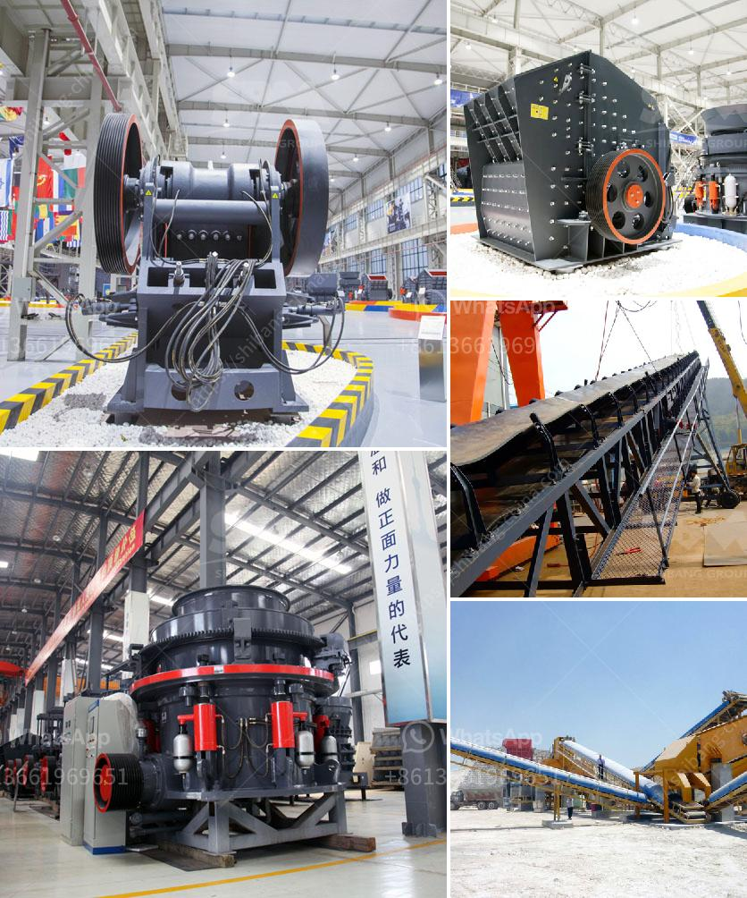

<h3>granite crushing plant in sri lanka</h3>
Granite is a common and widely occurring type of intrusive, felsic, igneous rock. Granites usually have a medium to coarse grained texture. Occasionally some individual crystals (phenocrysts) are larger than the groundmass in which case the texture is known as porphyritic. A granitic rock with a porphyritic texture is sometimes known as a porphyry. Granites can be pink to dark gray or even black, depending on their chemistry and mineralogy. Outcrops of granite tend to form tors and rounded massifs.

Granite is nearly always massive (lacking any internal structures), hard and tough, and therefore it has gained widespread use throughout human history as a construction stone. The granite used for decorative purposes is a costly material in comparison with other materials.

Granite has been extensively used as a dimension stone and as flooring tiles in public and commercial buildings and monuments. Polished granite is also a popular choice for kitchen countertops due to its high durability and aesthetic qualities. In building and for countertops, the term "granite" is often applied to all igneous rocks with large crystals, and not specifically to those with a granitic composition.

Sri Lanka is one of the most important Asia marketing of SBM, every year there are many customers from Sri Lanka buying crushers and grinding mills from SBM. SBM has been always providing our customers the best machines and the most professional service to attract more and more customers.

The customer started contact with SBM in 2011 and said they would like to set up a granite crushing plant in Sri Lanka in 2011 urgently. Raw material: granite. Max. Feeding size: 500-600mm. Output size: 0-6mm,6-12mm,12-19mm,19-37.5mm. Capacity: 120-150tph.

First, the raw materials are regularly conveyed into the elementary-crushing machine by the vibrating feeder, then the belt conveyor transfers the elementary products to impact crusher for secondary crush. The secondary products will be separated into stone of different sizes by the vibrating screen. The parts not satisfying the needs will be returned to the impact crusher for further crush. Size of final products can be combined and graded according to your specific requirement.

Second, the fine crushed granite materials are conveyed to vibrating screen for screening. If the raw materials do not meet the specifications, the screening materials will be conveyed to the impact crusher for re-crushing. If the requirements are met, materials graded by vibrating screen is conveyed to the finished products pile. The products with suitable size will be transferred to final product pile and those with unsuitable size will be transferred to the impact crusher for re-crushing. This forms closed and continuously automatic cycles. The plant can be equipped with dust removing facilities to protect environment according to customers' requests.

The final, briquettes produced by this sand-making line can be used in road construction and building construction. They can meet diverse material specifications, greatly promoting the development of local infrastructure and economy.

In conclusion, the granite crushing plant in Sri Lanka is suitable for crushing granite and widely used in highway construction, water conservancy projects, building rubble, and sand processing. And it is the best choice of artificial sand and stone processing equipment. So far, SBM has installed many crushing plants in Sri Lanka, where the most important aggregate quarries and production plants are located. SBM has built the complete 300TPH, 350TPH, 400TPH Stone Crushing Plant in Sri Lanka for producing building materials such as sand and aggregates. We are professional manufacturers and exporters of mine crushing equipment in Sri Lanka.
<h3>Contact us</h3><ul><li><strong>Whatsapp:&nbsp;<a href="https://wa.me/8613661969651">+8613661969651</a></strong></li><li><a href="https://swt.shibang-china.com/?git&amp;zhl&amp;granite crushing plant in sri lanka"><strong>Online Service(chat now)</strong></a></li></ul><h3>Related</h3><ul><li><a href='450 tph limestone crusher.md'>450 tph limestone crusher</a></li><li><a href='sayaji jaw crusher price list.md'>sayaji jaw crusher price list</a></li><li><a href='small cement grinding plant.md'>small cement grinding plant</a></li><li><a href='quarry business cost in india.md'>quarry business cost in india</a></li><li><a href='mobile mineral processing gravity plants.md'>mobile mineral processing gravity plants</a></li></ul>