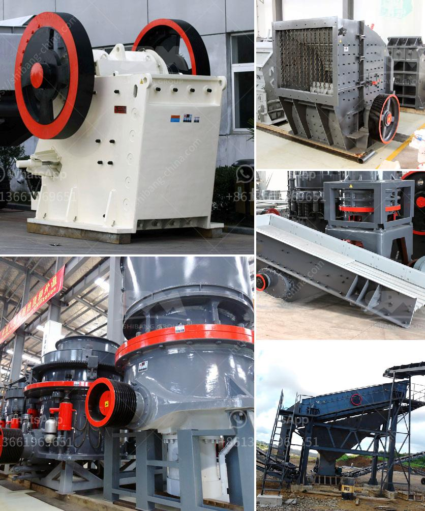

<h3>granite machine concrete</h3>
Concrete is undoubtedly one of the most commonly used materials in the construction industry due to its durability, versatility, and cost-effectiveness. However, not all concrete is created equal. Granite machine concrete stands out as a superior option, offering enhanced strength, longevity, and aesthetic appeal.

Granite machine concrete is a type of concrete that incorporates granite aggregates, known for their durability and strength. These aggregates are obtained from crushing granite rocks into various sizes, ranging from small pebbles to larger chunks. The combination of these robust aggregates with cement, sand, and water results in a concrete mix that surpasses standard concrete in both strength and resilience.

The key advantage of using granite aggregates in concrete lies in their exceptional hardness and durability, making the resultant material suitable for heavy-duty applications. Whether it's constructing bridges, highways, or industrial flooring, granite machine concrete can withstand heavy loads, extreme weather conditions, and impact forces, ensuring a longer service life.

Furthermore, granite machine concrete also offers enhanced resistance to chemical corrosion, making it an excellent choice for environments with exposure to chemicals, such as factories, parking lots, and warehouses. Its dense composition acts as a barrier against chemical agents that could damage or weaken traditional concrete.

Beyond its durability and strength, granite machine concrete also boasts an attractive appearance. The natural beauty of granite aggregates adds an aesthetic touch to any construction project. With a wide range of aggregate sizes and colors available, contractors have the flexibility to create unique and visually appealing structures, be it driveways, sidewalks, or architectural features.

In conclusion, granite machine concrete is a top-tier construction material that surpasses the qualities of standard concrete. Its exceptional strength, durability, and resistance to chemical corrosion make it ideal for a range of applications in the construction industry. Additionally, its visual appeal adds an extra touch of sophistication to any project. From durability to aesthetics, granite machine concrete offers a winning combination for construction projects that require long-lasting and visually appealing results.
<h3>Contact us</h3><ul><li><strong>Whatsapp:&nbsp;<a href="https://wa.me/8613661969651">+8613661969651</a></strong></li><li><a href="https://swt.shibang-china.com/?git&amp;zhl&amp;granite machine concrete"><strong>Online Service(chat now)</strong></a></li></ul><h3>Related</h3><ul><li><a href='marble crusher industry philippines.md'>marble crusher industry philippines</a></li><li><a href='slag grinding problems.md'>slag grinding problems</a></li><li><a href='stone crusher plate specifiion pdf sat.md'>stone crusher plate specifiion pdf sat</a></li><li><a href='stone crusher supplier company.md'>stone crusher supplier company</a></li><li><a href='jaw crusher seller in pakistan.md'>jaw crusher seller in pakistan</a></li></ul>