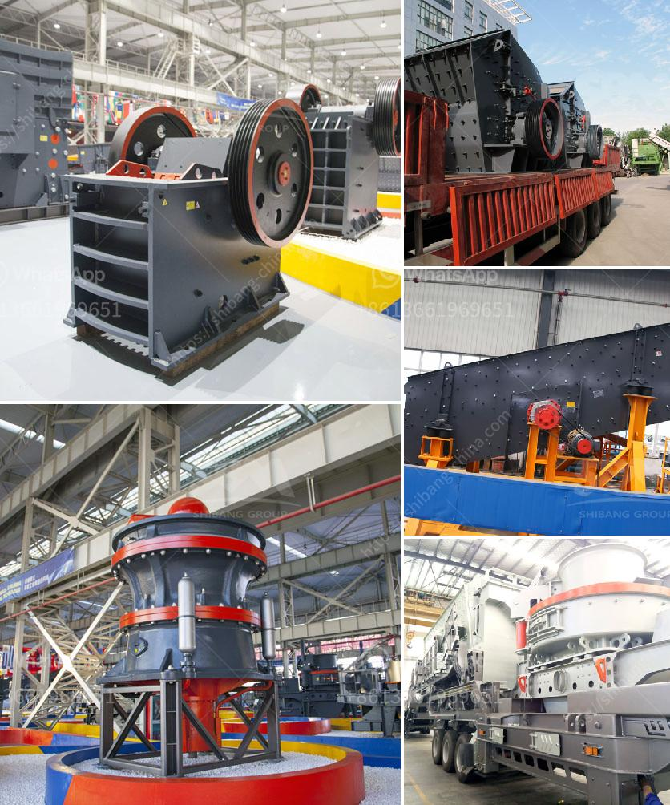

<h3>granite mining business plan</h3>
Granite has been a highly lucrative business for centuries. The demand for high-quality natural stones, used in the construction industry, has always been on the rise. With the booming infrastructure sector in many countries, the market for granite has never been better.

Starting a granite mining business requires a great deal of strategic planning, as well as a keen eye for detail. To assist in your planning process, we've highlighted some key factors that should be considered when creating a granite mining business plan.

Market analysis is a significant part of any business plan. Before diving into the granite mining business, you should assess your target market and competitors. Analyze the local construction market and identify potential customers who constantly need granite for their projects.

In addition, research existing granite mining companies to understand their business model, equipment, supply chain, and how they market their products. Studying your competition will provide insight into how you can differentiate yourself and position your company as a reliable and cost-effective option.

Choosing the right location for your granite mining operations is crucial. Look for areas rich in granite deposits and with easy accessibility for transportation. It's advisable to conduct an initial geological survey to evaluate the quality and quantity of granite available in the area.

Once you've identified a suitable location, acquire the land required for mining operations. Ensure that the land is legally available for commercial mining and meets all environmental regulations. Consult with local authorities and experts to obtain the necessary permits and licenses.

The success of your granite mining business heavily relies on robust infrastructure and the right equipment. Consider the infrastructure required for transportation, storage, and processing of raw granite blocks. This includes creating access roads, setting up storage yards, and establishing processing facilities.

Investing in the right equipment is equally essential. Depending on the scale of your operations, you'll need heavy machinery, such as excavators, loaders, crushers, and cutters, to extract and process granite. Prioritize quality and durability when choosing equipment, as they will be subjected to demanding working conditions.

Developing an effective sales and distribution strategy is critical to ensuring a steady revenue stream for your granite mining business. Identify potential buyers, such as construction companies, contractors, and landscape architects. Build relationships with them and understand their specific requirements.

Besides traditional selling methods, consider establishing an online presence to reach a broader market. Create a website showcasing your product range and services, and utilize social media platforms to promote your brand. Attending trade shows and industry exhibitions can also help generate leads and increase brand visibility.

Mining operations, if not managed properly, can have a significant negative impact on the environment. To ensure sustainable mining practices, incorporate environmental safeguards into your business plan. Implement measures to minimize water and air pollution, reforest mined areas, and adopt eco-friendly technologies.

Furthermore, proactively engage with local communities and environmental organizations. Actively participate in community development initiatives and follow responsible mining practices to build a positive reputation and mitigate any potential conflicts.

In conclusion, a granite mining business can be a lucrative endeavor with proper planning and execution. Conduct thorough market research, secure the right location and land, invest in high-quality infrastructure and equipment, develop a strong sales and distribution strategy, and prioritize environmental sustainability. By following these guidelines, you'll be well on your way to establishing a successful granite mining operation.
<h3>Contact us</h3><ul><li><strong>Whatsapp:&nbsp;<a href="https://wa.me/8613661969651">+8613661969651</a></strong></li><li><a href="https://swt.shibang-china.com/?git&amp;zhl&amp;granite mining business plan"><strong>Online Service(chat now)</strong></a></li></ul><h3>Related</h3><ul><li><a href='cement factory for sale in andra pradesh.md'>cement factory for sale in andra pradesh</a></li><li><a href='how to set up a stone quarry company.md'>how to set up a stone quarry company</a></li><li><a href='mobile concrete crusher trailer mounted.md'>mobile concrete crusher trailer mounted</a></li><li><a href='difference between pulveriser and.md'>difference between pulveriser and</a></li><li><a href='new stamp mill for sale in zimbabwe.md'>new stamp mill for sale in zimbabwe</a></li></ul>