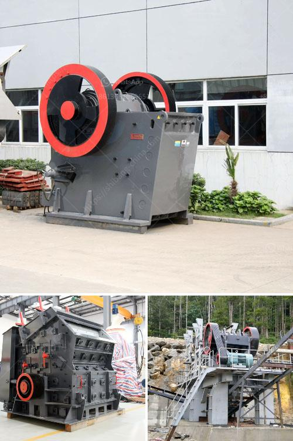

<h3>granite quarry companies in europe</h3>
Granite is one of the most durable and stylish natural stones used in construction. Known for its strength and unique patterns, granite has become a popular choice for countertops, flooring, and other architectural features. In Europe, there are numerous granite quarry companies that extract the stone for various purposes.

The granite quarrying industry in Europe is well-established with a rich history dating back hundreds of years. Many countries in Europe, including Italy, Spain, Portugal, and Sweden, are renowned for their quality granite quarries. These countries have vast reserves of this valuable material, making them major players in the global granite market.

Italy is perhaps the most famous European country when it comes to granite quarrying. The country has a long tradition of extracting and processing high-quality stone materials. Regions like Carrara and Verona are particularly renowned for their marble and granite quarries. These quarries produce a wide range of granite types, including Carrara white, Nero Assoluto, and Absolute Black, which are highly sought after for their beauty and durability.

Spain is another significant granite quarrying country in Europe. The region of Galicia, in northwest Spain, is renowned for its granite quarries. The quarries in this area produce a wide variety of granite types, including Rosa Porriño, Blanco Cristal, and Gris Mondariz. Spanish granite is known for its unique color variations and exceptional quality, and it is highly regarded by architects and designers worldwide.

Portugal is also a notable player in the European granite industry. The country is known for its distinctive grey and pink granite varieties, such as Rosa Portugal, Rosa Aurora, and Azul Valverde. Portuguese granite is highly appreciated for its beauty and versatility and is often used in high-end projects around the world.

In Sweden, granite quarrying has been an important economic activity for centuries. Swedish granite is famous for its durability and unique colors, making it a popular choice for both interior and exterior applications. The Bohuslän region in southwestern Sweden is known for its high-quality granite quarries, which produce materials like Bohus Grey, Vanga Red, and Black Pearl.

European granite quarries have embraced modern technologies to enhance efficiency and sustainability. Many of these companies use advanced machinery and equipment for extraction and processing, ensuring a consistent supply of high-quality granite. In recent years, the industry has also made significant efforts to reduce its environmental impact through reclamation and recycling practices.

The European granite quarry companies have a global presence, exporting their products to various countries around the world. The demand for European granite remains strong due to its exceptional quality and aesthetic appeal. Architects, designers, and homeowners value the durability, unique patterns, and timeless elegance of European granite, making it a preferred choice for a wide range of applications.

In conclusion, Europe is home to numerous granite quarry companies that extract some of the finest and most beautiful natural stones in the world. Countries like Italy, Spain, Portugal, and Sweden have rich reserves of granite and a long history of quarrying and processing this valuable material. The European granite industry has embraced modern technologies and sustainable practices to meet the demand for high-quality granite globally. With its durability, aesthetic appeal, and versatility, European granite continues to be a popular choice for countless construction and design projects worldwide.
<h3>Contact us</h3><ul><li><strong>Whatsapp:&nbsp;<a href="https://wa.me/8613661969651">+8613661969651</a></strong></li><li><a href="https://swt.shibang-china.com/?git&amp;zhl&amp;granite quarry companies in europe"><strong>Online Service(chat now)</strong></a></li></ul><h3>Related</h3><ul><li><a href='sand making machine in south africa.md'>sand making machine in south africa</a></li><li><a href='vibrating feeder zenith.md'>vibrating feeder zenith</a></li><li><a href='best mill for wet grinding of calcium carbonate.md'>best mill for wet grinding of calcium carbonate</a></li><li><a href='small scale stone crusher price list.md'>small scale stone crusher price list</a></li><li><a href='bentonite plant german.md'>bentonite plant german</a></li></ul>