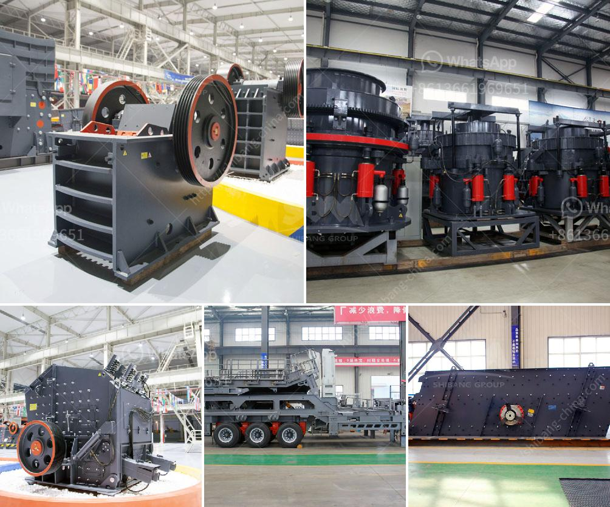

<h3>granite quarry in nigeria</h3>
Granite is a crucial component in the construction industry. It is used for the production of flooring tiles, kitchen countertops, and even building materials. Due to its wide application and high market demand, Nigeria is experiencing a significant growth in its granite quarrying industry.

Starting a granite quarry in Nigeria is moderately capital-intensive. It requires a considerable investment but promises huge returns. The market for granite products is both local and international, and this provides ample opportunities for investors to explore.

Granite deposits in Nigeria are predominately found in rural areas. Though granite quarrying has improved the livelihood of many individuals in these rural areas, the industry still suffers from some significant challenges. This includes land acquisition, technical knowledge, and inadequate funding.

To embark on this venture successfully, it is essential to have a proper understanding of the quarrying process, the potential market, and the available resources. A comprehensive business plan will help guide potential investors through the necessary steps and ensure a profitable venture.

The first step in starting a granite quarry is to secure a suitable land. This will require some negotiations with the local community and the government to obtain the necessary mining licenses and permits. It is crucial to ensure that the land purchased has proven granite reserves that can be utilized profitably.

Once the land is secured, the next step is to carry out a geological survey to determine the quality and quantity of granite reserves. This survey will provide valuable information on the type of machinery and tools required for quarrying operations, as well as estimates on the expected output.

Investing in modern machinery and equipment is crucial to maximizing productivity and efficiency in a granite quarry. Heavy-duty excavators, loaders, and crushers are essential for breaking down and extracting the granite blocks from the quarry. Additionally, efficient cutting and polishing machines are required to transform the raw blocks into finished products of various sizes and shapes.

One of the challenges faced by granite quarry owners and operators in Nigeria is the lack of technical expertise. To overcome this, partnerships can be formed with foreign companies that specialize in granite quarrying. This will provide access to advanced technology, training for local workers, and transfer of knowledge in granite processing and marketing.

Marketing granite products requires a thorough understanding of the local and international markets. The demand for granite products in Nigeria is driven by the construction industry, and it is crucial to establish relationships with builders, contractors, and government agencies involved in infrastructure development projects.

To tap into the international market, it is essential to align with global granite trading networks and participate in trade fairs and exhibitions. Building a strong brand and reputation for consistently delivering high-quality granite products is key in securing repeat business and expanding market reach.

In conclusion, starting a granite quarry in Nigeria can be a profitable venture if the necessary steps and factors are taken into consideration. Proper land acquisition, geological surveys, investment in modern machinery, technical expertise, and effective marketing strategies are crucial elements for success in the granite quarrying industry. With the right approach, investors can capitalize on the growing demand for granite products both locally and internationally.
<h3>Contact us</h3><ul><li><strong>Whatsapp:&nbsp;<a href="https://wa.me/8613661969651">+8613661969651</a></strong></li><li><a href="https://swt.shibang-china.com/?git&amp;zhl&amp;granite quarry in nigeria"><strong>Online Service(chat now)</strong></a></li></ul><h3>Related</h3><ul><li><a href='grinding milling equipment in south africa.md'>grinding milling equipment in south africa</a></li><li><a href='buy stone crusher india.md'>buy stone crusher india</a></li><li><a href='vibrating screen for 150 microns.md'>vibrating screen for 150 microns</a></li><li><a href='list of machinery for 3000 tonnes per hour crusher.md'>list of machinery for 3000 tonnes per hour crusher</a></li><li><a href='italia crusher machine.md'>italia crusher machine</a></li></ul>