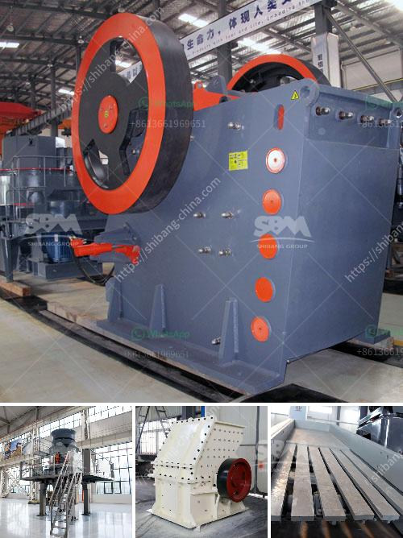

<h3>granite quarry machines</h3>
Granite is a popular natural stone that is used for various construction and decorative purposes. Whether it's for kitchen countertops, bathroom vanities, or commercial flooring, granite provides durability, elegance, and versatility. To meet the growing demand for this exquisite stone, modern granite quarries rely on advanced machinery to extract, process, and polish the granite blocks. These granite quarry machines have revolutionized the way granite is quarried and processed, significantly increasing efficiency and productivity.

One of the key machines in granite quarry operations is the diamond wire saw. This revolutionary tool combines a long wire coated with industrial-grade diamonds, which can cut through granite with precision and ease. The wire saw is attached to a machine that controls the slicing process, allowing workers to extract large blocks of granite from the quarry walls. This method is not only efficient but also minimizes waste, as the wire can be re-used multiple times.

Another notable machine used in granite quarries is a hydraulic drilling rig. These rigs are used to drill holes into the granite mass, which are then filled with explosive materials. The controlled explosion helps to loosen the granite, making it easier to extract large blocks. These drilling rigs are equipped with advanced technology that ensures accuracy and safety during the drilling process.

Once the granite blocks are extracted, they need further processing to attain the desired finish. Granite cutting machines, such as bridge saws and CNC machines, are used to shape and cut the blocks into the desired dimensions. These machines employ diamond-studded blades or bits that can make precise cuts, ensuring uniformity and precision in the final product.

To enhance the appearance of granite slabs, they undergo the polishing process. Polishing machines equipped with rotating abrasive pads or brushes smooth the surface and bring out the natural shine and color of the granite. These machines are designed to apply consistent pressure and movement, resulting in a flawless finish.

In conclusion, granite quarry machines play a crucial role in the extraction, processing, and finishing of granite. From diamond wire saws to hydraulic drilling rigs, these advanced technologies have allowed for higher efficiency and productivity in granite quarry operations. With the help of these machines, granite continues to be a sought-after material for various applications, proving its timeless appeal and durability.
<h3>Contact us</h3><ul><li><strong>Whatsapp:&nbsp;<a href="https://wa.me/8613661969651">+8613661969651</a></strong></li><li><a href="https://swt.shibang-china.com/?git&amp;zhl&amp;granite quarry machines"><strong>Online Service(chat now)</strong></a></li></ul><h3>Related</h3><ul><li><a href='hard rock ultrafine grinder in canada.md'>hard rock ultrafine grinder in canada</a></li><li><a href='talc grinding machine manufacturer from uzbekistan.md'>talc grinding machine manufacturer from uzbekistan</a></li><li><a href='cost of crushing equipments in nigeria.md'>cost of crushing equipments in nigeria</a></li><li><a href='used limestone pulverizers crusher for sale texas.md'>used limestone pulverizers crusher for sale texas</a></li><li><a href='portable cone crusher plant.md'>portable cone crusher plant</a></li></ul>