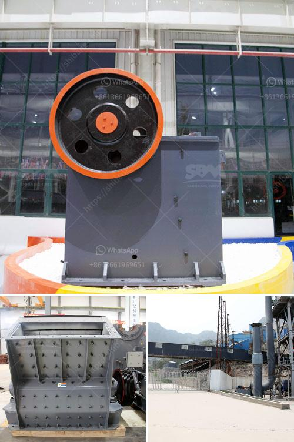

<h3>graphite manufacturing youtube</h3>
Youtube, the world's largest video-sharing platform, has become the go-to digital space for people to share their knowledge on countless subjects. From cooking tutorials to travel vlogs, the platform has emerged as an educational hub for people seeking to learn and explore new things. One fascinating niche on Youtube is graphite manufacturing, where creators showcase the art and science of creating graphite, a versatile material known for its unique properties.

Graphite, derived from carbon, is a vital element used in various industries, such as aerospace, automotive, and energy. Its applications range from being a crucial component in lithium-ion batteries to forming the core of graphite pencils. With such significance, the demand for graphite remains high, leading to a rising interest in how this fascinating material is manufactured.

Enter the world of graphite manufacturing Youtube videos, where experts and enthusiasts share their insights on the intricate process. Creators take viewers behind the scenes, unveiling the various stages involved in graphite production. From the initial purification of raw carbon to the precise techniques used in mold formation, these videos provide a comprehensive view of the manufacturing process.

The Youtube platform allows creators to present the artistry involved in graphite manufacturing. From sculpting graphite into intricate shapes to creating stunning graphite art, viewers are treated to a visual feast of extraordinary craftsmanship. These videos not only showcase the skills and talent of graphite artisans but also inspire aspiring artists to explore the endless possibilities of this unique material.

Moreover, Youtube serves as an educational platform, enabling viewers to delve into the science behind graphite manufacturing. Creators discuss the physical properties of graphite, such as its excellent conductivity, lubricity, and high melting point, providing viewers with a deeper understanding of its wide-ranging applications.

By fostering a community of graphite enthusiasts, Youtube empowers individuals with knowledge and appreciation for this remarkable material. Viewers can engage with creators through comments, exchange ideas, and even collaborate on exciting projects. This collaborative environment propels innovation in the field of graphite manufacturing, driving the industry forward.

In conclusion, graphite manufacturing Youtube videos have emerged as a valuable resource for those interested in exploring the art and science behind this versatile material. Whether you are an artist seeking inspiration or an engineer eager to learn about the manufacturing process, Youtube provides a platform to delve into the world of graphite. So, grab your pencil, start watching, and unlock the endless possibilities that graphite offers!
<h3>Contact us</h3><ul><li><strong>Whatsapp:&nbsp;<a href="https://wa.me/8613661969651">+8613661969651</a></strong></li><li><a href="https://swt.shibang-china.com/?git&amp;zhl&amp;graphite manufacturing youtube"><strong>Online Service(chat now)</strong></a></li></ul><h3>Related</h3><ul><li><a href='jaw crusher manufacturers in gujarat.md'>jaw crusher manufacturers in gujarat</a></li><li><a href='material vibrator feeder.md'>material vibrator feeder</a></li><li><a href='japan crusher equipment.md'>japan crusher equipment</a></li><li><a href='crushing plant methodology.md'>crushing plant methodology</a></li><li><a href='crusher gap crusher.md'>crusher gap crusher</a></li></ul>