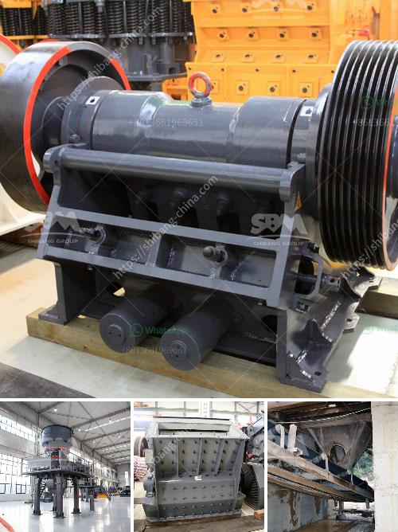

<h3>gravel crushers in saskatchewan for sale</h3>
In Saskatchewan, gravel crushers are a highly sought-after commodity in the construction industry. Whether it's dense-grade gravel, pea gravel, or any other type of aggregate material, these crushers are able to process it efficiently and turn it into usable products. With the increasing demand for materials in construction projects, gravel crushers play a vital role in meeting these requirements. This article will explore the significance and availability of gravel crushers in Saskatchewan for sale.

Saskatchewan boasts vast reserves of gravel, making it an ideal location for the production and sale of gravel crushers. The province is known for its rich mineral resources, including abundant gravel deposits. As a result, the gravel crusher industry has flourished in Saskatchewan, providing a steady supply of crushed gravel for various construction and infrastructure projects.

Gravel crushers are essential for any construction project that requires the use of gravel or crushed stone. These machines are capable of breaking down large rocks into smaller, more manageable sizes, and then transforming them into gravel of different grades. The versatility of these crushers allows for a wide range of applications, from building roads to creating foundations for buildings. They are also used extensively in landscaping projects, such as creating pathways and driveways.

Saskatchewan is home to several companies that specialize in the design, manufacture, and sale of gravel crushers. These companies offer a variety of crushers with different capacities, sizes, and features to cater to the needs of contractors and construction companies. Whether it's a small-scale project or a large-scale endeavor, there is a gravel crusher available that can deliver the desired results.

The availability of gravel crushers in Saskatchewan for sale means that contractors and construction companies can conveniently acquire these machines to meet their project requirements. Furthermore, purchasing a gravel crusher in Saskatchewan offers various benefits. Firstly, it eliminates the need for transport and allows for immediate access to the crusher, reducing downtime and increasing productivity. Secondly, buying locally supports the provincial economy and promotes local businesses.

When considering the purchase of a gravel crusher in Saskatchewan, it is important to carefully assess the machine's specifications, capabilities, and overall performance. The size and type of projects that the crusher will be used for should be taken into account, as this will determine the necessary capacity and features required. Additionally, factors such as maintenance requirements, service and support, and the warranty provided by the manufacturer should also be considered.

In conclusion, gravel crushers are an indispensable tool in the construction industry, providing an efficient and reliable means of processing gravel and creating valuable materials for various applications. In Saskatchewan, the availability of gravel crushers for sale reflects the thriving industry and the high demand for these machines. Contractors and construction companies can benefit from purchasing locally and choosing the right crusher that suits their specific needs. With the wealth of resources and expertise available in the province, Saskatchewan is an ideal destination for acquiring high-quality gravel crushers.
<h3>Contact us</h3><ul><li><strong>Whatsapp:&nbsp;<a href="https://wa.me/8613661969651">+8613661969651</a></strong></li><li><a href="https://swt.shibang-china.com/?git&amp;zhl&amp;gravel crushers in saskatchewan for sale"><strong>Online Service(chat now)</strong></a></li></ul><h3>Related</h3><ul><li><a href='mobile copper ore shaking table.md'>mobile copper ore shaking table</a></li><li><a href='rock crushing plant mobile.md'>rock crushing plant mobile</a></li><li><a href='difference between sand and crushed stone powder.md'>difference between sand and crushed stone powder</a></li><li><a href='chrome ore washing plant.md'>chrome ore washing plant</a></li><li><a href='stone crushers suppliers in south africa.md'>stone crushers suppliers in south africa</a></li></ul>