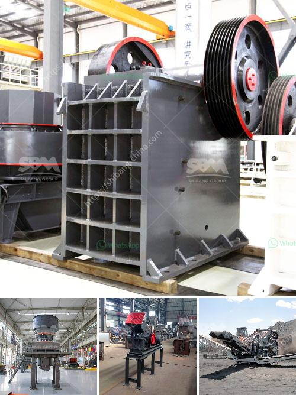

<h3>gravel crushing machine in ethiopia</h3>
Gravel crushing machines are widely used in mining, infrastructure and construction industries. China has been the backbone of the global gravel market, manufacturing gravel crushers of different specifications, models and production capacities. With the development of economy and technology, gravel crushers are also constantly innovated and upgraded. In recent years, these advanced gravel crushers have made their way to Ethiopia.

Ethiopia, with its rapid economic growth, has been attracting foreign investors from all over the world. The demand for gravel in the construction industry in Ethiopia is increasing year by year, and its market potential is great. To meet the growing demand, Ethiopia imported a large number of gravel crushers from China every year.

As an important manufacturer in China, Henan Hongxing Mining Machinery Co., Ltd. has been providing various types of Gravel Crushers for the Ethiopian market, including jaw crushers, impact crushers, cone crushers, hammer crushers, roller crushers, and mobile crushing and screening equipment, etc. Over the years, Hongxing Machinery has consistently adhered to the principle of "customer first, quality first, and service first." All products are made with meticulous attention to detail, complete with quality assurance and technical support.

Gravel crushing machines are commonly used in mining, metallurgy, building materials, transportation and other industries to crush various ores and rocks with compressive strength below 320MPa. Ethiopian construction projects have strict requirements for product size, and Hongxing gravel crushers are equipped with various crushing cavities, which can meet different requirements.

With the improvement of living standards and infrastructure construction in Ethiopia, the demand for gravel is expected to continue to rise. Gravel crushing machines provided by Hongxing Machinery have played an important role in promoting the development of the Ethiopian construction industry. Looking forward to the future, Hongxing Machinery will continue to adhere to the principle of "customer first" and provide high-quality products and services to customers in Ethiopia and around the world.
<h3>Contact us</h3><ul><li><strong>Whatsapp:&nbsp;<a href="https://wa.me/8613661969651">+8613661969651</a></strong></li><li><a href="https://swt.shibang-china.com/?git&amp;zhl&amp;gravel crushing machine in ethiopia"><strong>Online Service(chat now)</strong></a></li></ul><h3>Related</h3><ul><li><a href='crusher machine south africa.md'>crusher machine south africa</a></li><li><a href='mini cement plant tons per day.md'>mini cement plant tons per day</a></li><li><a href='basalt crusher machine prices.md'>basalt crusher machine prices</a></li><li><a href='super fine powder grinder.md'>super fine powder grinder</a></li><li><a href='small scale industrial pulveriser.md'>small scale industrial pulveriser</a></li></ul>