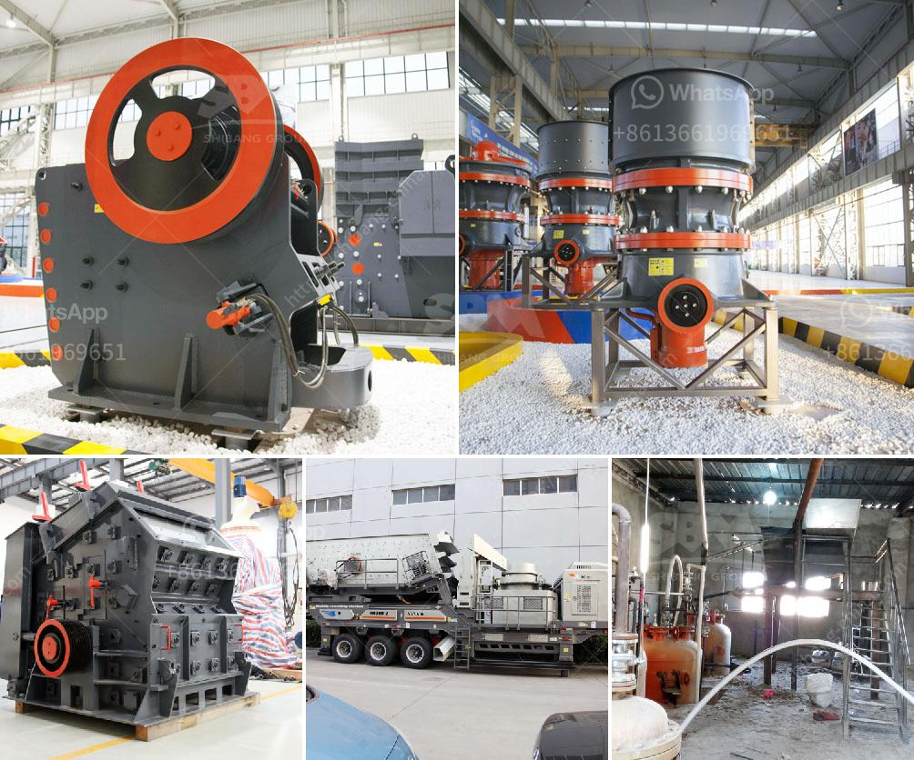

<h3>gravel jaw crushers for sale in south africa</h3>
With the increasing popularity of gravel jaw crusher in South Africa, more and more customers are asking how much South Africa gravel jaw crushers should cost. Sand and gravel production line is composed of various crushing equipment. The gravel jaw crusher is one of the most widely used crushing equipment in gravel production.

Gravel jaw crushers are generally used in the primary crushing of raw materials in the production line process. It can be used in various ores, such as limestone, basalt, granite, river pebble, construction waste, etc. Nowadays, the gravel jaw crusher in South Africa is mostly used to crush various kinds of ores and bulk materials into medium size particles.

Due to its simple structure, reliable performance and easy maintenance, jaw crusher has become the most popular crushing equipment in South Africa. Many types of jaw crushers have been developed over the years in order to optimize the performance of primary crushing plants. These models range from portable, mobile, industrial, semi-portable to stationary types.

1. Portable Jaw Crushers: They are wheel-mounted jaw crushing plants equipped with jaw crushers, vibrating feeders, belt conveyors and separate machines for stockpiling return materials. They are widely used in road construction, building construction, metallurgy, energy and other industries.

2. Mobile Jaw Crushers: They are tire-type mobile jaw crushers, which are mainly used in metallurgy, chemical industry, building materials, utilities and other materials processing operations often need to move materials, especially for highways, railways, hydropower projects and other mobile stone operations.

3. Industrial Jaw Crushers: They are mainly used in laboratories and sample processing plants. They are small in size and can be used for sample crushing or small-scale production of industrial materials.

4. Semi-portable Jaw Crushers: They are similar to portable crushers but have slightly different structures. They are more suitable for supporting large-scale crushing and screening plants.

5. Stationary Jaw Crushers: These machines are the traditional and basic crushing equipment in stone crushing plants. They are widely used in primary crushing stages.

In South Africa, stationary jaw crushers for sale are mainly used for coarse crushing and crushing in the fields of mining, building materials, infrastructure construction and other industries. According to the specific needs of customers, the market demands various types of stationary jaw crushers for sale, including PE jaw crusher, CJ European jaw crusher, HD German jaw crusher, PEX jaw crusher and PEZ hydraulic jaw crusher.

In addition to these models, there are also different types and models of crushers, such as impact crushers, cone crushers, and mobile crushers. For the choice of gravel jaw crusher, different types of jaw crushers have different production capacities.

In general, the capacity of the gravel jaw crusher in South Africa is between 1-800 tons per hour. In addition to the production capacity, the size of the feed port should also be considered when choosing the crusher. If the feeding size is large, it will affect the production efficiency of the crusher if the size is too small may lead to the waste of resources. Therefore, the size of the feed port should be appropriate for the raw materials to be crushed.

In conclusion, the gravel jaw crushers in South Africa are often used for high-quality gravel production. As long as the feed size is reasonable, the sand and gravel production line is well matched, and the installation and maintenance are convenient, the jaw crusher is an ideal choice for gravel production.
<h3>Contact us</h3><ul><li><strong>Whatsapp:&nbsp;<a href="https://wa.me/8613661969651">+8613661969651</a></strong></li><li><a href="https://swt.shibang-china.com/?git&amp;zhl&amp;gravel jaw crushers for sale in south africa"><strong>Online Service(chat now)</strong></a></li></ul><h3>Related</h3><ul><li><a href='dealers of mobile jaw crusher in kenya.md'>dealers of mobile jaw crusher in kenya</a></li><li><a href='silica sand concrete in ethiopia.md'>silica sand concrete in ethiopia</a></li><li><a href='materials used in mining gold and diamond.md'>materials used in mining gold and diamond</a></li><li><a href='calcium roller mill.md'>calcium roller mill</a></li><li><a href='vibrating screen for 150 microns.md'>vibrating screen for 150 microns</a></li></ul>