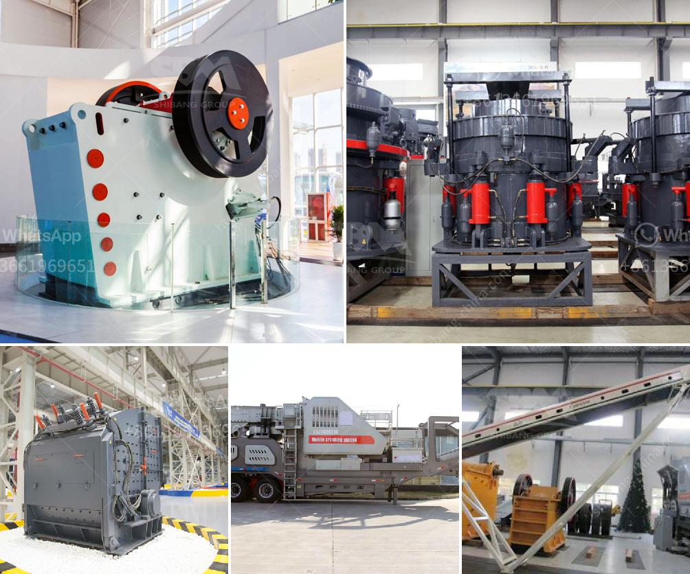

<h3>gravimetric centrifugal gold concentrator</h3>
Gold mining is an age-old industry that dates back thousands of years. Throughout history, civilizations have been fascinated by the shiny metal and have sought different techniques to extract it from the ground. In the modern era, gold mining has become a highly specialized and technologically advanced process, aiming for higher efficiency and maximum gold recovery. One of the latest developments in the field is the gravimetric centrifugal gold concentrator, which has revolutionized the way gold is extracted.

The gravimetric centrifugal gold concentrator is a machine that uses centrifugal force to separate gold particles based on their weight. This process utilizes the density differences between gold and other minerals in ore to efficiently recover gold particles. Unlike traditional gold extraction methods that rely on the use of water and chemicals, the gravimetric centrifugal gold concentrator operates solely on the principle of gravity separation.

The core component of this concentrator is the rotor bowl, which is rotated at a high speed. As the slurry containing gold ore enters the rotor bowl, the centrifugal force causes heavier particles to migrate towards the bowl's wall, while lighter particles are pushed towards the center. This separation based on weight allows the gold particles to be concentrated in the outer ring of the rotor bowl, while the unwanted minerals are flushed out through an adjustable valve.

One of the key advantages of the gravimetric centrifugal gold concentrator is its ability to process large volumes of ore within a relatively short period. This machine can handle up to several tons of ore per hour, depending on its size and capacity. This high processing capacity is crucial for modern gold mining operations, as it allows for increased productivity and profitability.

Another significant advantage is the absence of chemicals or water in the extraction process. Traditional gold extraction methods often rely on the use of toxic chemicals, such as cyanide, to dissolve the gold from the ore. These chemicals pose significant environmental risks and require careful handling and disposal. The gravimetric centrifugal gold concentrator eliminates the need for such chemicals, making it a safer and greener alternative.

The simplicity of operation and maintenance is yet another benefit of this concentrator. Its streamlined design and intuitive controls make it easy to operate, even for inexperienced operators. Additionally, the lack of moving parts reduces the risk of mechanical failure and ensures lower maintenance costs.

Furthermore, the gravimetric centrifugal gold concentrator can be used in various mining settings and is suitable for both hard rock and alluvial gold. Whether it is deep underground mines or open-pit operations, this machine can adapt to different conditions and contribute to the overall success of the mining operation.

In conclusion, the gravimetric centrifugal gold concentrator represents a significant advancement in the gold mining industry. Its ability to efficiently recover gold particles based on their weight, its high processing capacity, and its environmental sustainability make it an ideal solution for modern gold mining operations. With this revolutionary machine, gold miners can enhance their productivity, profitability, and maintain sustainable practices.
<h3>Contact us</h3><ul><li><strong>Whatsapp:&nbsp;<a href="https://wa.me/8613661969651">+8613661969651</a></strong></li><li><a href="https://swt.shibang-china.com/?git&amp;zhl&amp;gravimetric centrifugal gold concentrator"><strong>Online Service(chat now)</strong></a></li></ul><h3>Related</h3><ul><li><a href='limestone crusher limestone crusher equipment.md'>limestone crusher limestone crusher equipment</a></li><li><a href='portable stone crusher machine for sale.md'>portable stone crusher machine for sale</a></li><li><a href='crusher plant manufacturers in south africa.md'>crusher plant manufacturers in south africa</a></li><li><a href='stone crusher and quarry plant in galway ireland.md'>stone crusher and quarry plant in galway ireland</a></li><li><a href='vibrating screening machine.md'>vibrating screening machine</a></li></ul>