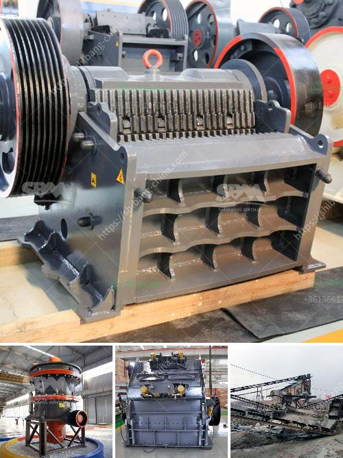

<h3>grinder rock crusher</h3>
A grinder rock crusher is a machine that is designed to reduce large rocks into smaller rocks, gravel, or rock dust. This innovative piece of equipment is designed to make crushing and grinding rock as easy as possible. It is commonly used in the mining industry for processing and crushing ores.

One of the main advantages of a grinder rock crusher is its versatility. It is capable of crushing a wide variety of rock types, including granite, limestone, quartzite, sandstone, and more. This makes it highly useful for various applications in mining, construction, and even recycling.

The grinder rock crusher operates by using a high-powered motor that spins a series of blades or hammers to crush the rock into smaller pieces. These blades or hammers are attached to a rotor, which revolves at a high speed. As the rotor rotates, the blades or hammers strike the rock, breaking it down into smaller fragments.

The crushed rock is then discharged through a screen or grate. Depending on the desired size of the final product, different sizes of screens or grates can be used. This allows for the production of multiple sizes of crushed rock, catering to different needs.

In addition to crushing, a grinder rock crusher can also grind the rock into a fine powder. This powdered rock can then be used for various purposes, such as in the creation of concrete, asphalt, or even agricultural fertilizers. The ability to grind rock makes the grinder rock crusher an extremely versatile machine.

Another advantage of a grinder rock crusher is its efficiency. The high-powered motor and rotating blades or hammers enable the machine to crush and grind rocks quickly and with minimal effort. This not only saves time but also reduces labor costs, making it a cost-effective solution for crushing and grinding rock.

Furthermore, a grinder rock crusher is designed to be durable and long-lasting. The blades or hammers are typically made of high-quality materials, such as hardened steel or carbide, to withstand the intense crushing and grinding forces. Additionally, the machine is usually equipped with various safety features to protect the operator and prevent accidents.

In conclusion, a grinder rock crusher is an invaluable machine in the mining industry. Its ability to crush and grind rocks, as well as its versatility and efficiency, make it a vital tool for processing ores. Whether it is used in mining, construction, or recycling, this machine offers numerous benefits and is essential for many operations. With its durability and safety features, a grinder rock crusher is a reliable and cost-effective investment for any business in need of rock crushing and grinding capabilities.
<h3>Contact us</h3><ul><li><strong>Whatsapp:&nbsp;<a href="https://wa.me/8613661969651">+8613661969651</a></strong></li><li><a href="https://swt.shibang-china.com/?git&amp;zhl&amp;grinder rock crusher"><strong>Online Service(chat now)</strong></a></li></ul><h3>Related</h3><ul><li><a href='vail crushing meachine models in pharma.md'>vail crushing meachine models in pharma</a></li><li><a href='grinding machinery manufecture in africa.md'>grinding machinery manufecture in africa</a></li><li><a href='raymond mills usa.md'>raymond mills usa</a></li><li><a href='crusher plant made in pakistan price.md'>crusher plant made in pakistan price</a></li><li><a href='list of machinery used in cement plant.md'>list of machinery used in cement plant</a></li></ul>