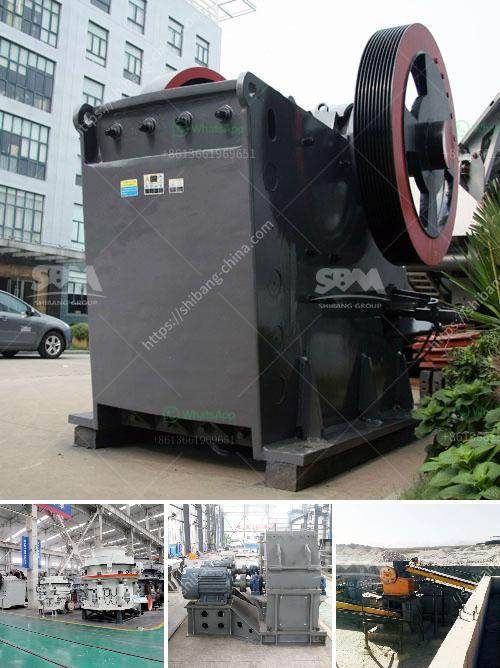

<h3>grinding and mixing machine for quartz</h3>
Quartz is a common mineral found in many geological formations around the world. The high hardness of quartz, along with its chemical inertness and optical properties, makes it an ideal material for various industries. One of the key steps in processing quartz is grinding it down to the desired particle size, which is done using grinding and mixing machines.

Grinding machines are designed to break down quartz into smaller particles through the use of abrasive surfaces. These machines come in various forms, including ball mills, hammer mills, and jaw crushers. The primary objective of grinding is to reduce the particle size of quartz to a level that can be further processed or used for various applications.

Mixing machines, on the other hand, are used to combine different components or materials to create a homogenous mixture. In the case of quartz, mixing machines are often used to blend different grades of quartz, creating a uniform composition that meets specific requirements. These machines can vary in design and complexity depending on the scale and purpose of the mixing process.

The choice of grinding and mixing machine for quartz largely depends on the specific requirements of the application. Factors such as the desired particle size, capacity, and production volume play a crucial role in selecting the appropriate equipment. Additionally, the hardness and abrasiveness of quartz can influence the type of machine used.

For instance, ball mills are commonly used for grinding quartz due to their versatility and ability to handle both dry and wet grinding. They consist of a rotating drum filled with grinding media, such as steel balls, which helps to break down the quartz particles through impact and attrition. Ball mills also offer the advantage of adjustable fineness control, allowing operators to achieve the desired particle size.

Hammer mills, on the other hand, are often used for coarse grinding of quartz. They utilize a series of hammers mounted on a rotating shaft to pulverize the quartz particles. Hammer mills are known for their high-speed impact action, resulting in a more aggressive and faster grinding process compared to ball mills.

In terms of mixing machines, planetary mixers are commonly used for blending different grades of quartz. These mixers utilize a planetary motion to ensure thorough and uniform mixing. The speed and rotation direction of the blades can be adjusted to achieve the desired mixing intensity.

In conclusion, grinding and mixing machines are essential in the processing of quartz. The selection of the appropriate machine depends on various factors, such as the desired particle size, capacity, and production volume. By using the right equipment, manufacturers can achieve efficient and precise grinding and blending of quartz, contributing to the production of high-quality quartz products for various applications.
<h3>Contact us</h3><ul><li><strong>Whatsapp:&nbsp;<a href="https://wa.me/8613661969651">+8613661969651</a></strong></li><li><a href="https://swt.shibang-china.com/?git&amp;zhl&amp;grinding and mixing machine for quartz"><strong>Online Service(chat now)</strong></a></li></ul><h3>Related</h3><ul><li><a href='roll mill machine.md'>roll mill machine</a></li><li><a href='pf series impact crusher.md'>pf series impact crusher</a></li><li><a href='sample quarry business plan.md'>sample quarry business plan</a></li><li><a href='mobile crusher stone.md'>mobile crusher stone</a></li><li><a href='pebble production line.md'>pebble production line</a></li></ul>