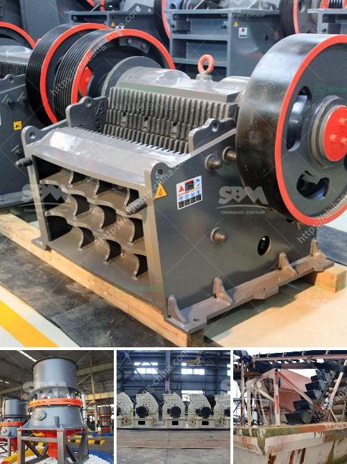

<h3>grinding crushing mill brick</h3>
Bricks have been one of the oldest and most widely used construction materials in the world. The term brick refers to any rectangular unit made of clay-bearing soil, sand, and lime, or concrete materials. Bricks are essential in creating functional and aesthetically pleasing structures such as houses, buildings, and pavements. However, the process of manufacturing bricks involves several steps, including grinding and crushing the raw materials.

To create bricks, the raw materials are first gathered and sorted. Clay, sand, and lime or concrete materials are commonly used in the production process. The grinding and crushing of the raw materials in a grinding crushing mill brick ensure proper mixing and homogenization of the materials, resulting in consistent quality bricks.

The grinding crushing mill brick is an essential machine in the brick manufacturing process. It is primarily used to crush the clay and transform it into powder-like substance. The machine is designed to break larger-sized bricks into smaller pieces and crush them into a fine powder, which is then used as a raw material for producing bricks.

The grinding crushing mill brick is equipped with various rotating hammers and blades that crush and grind the raw materials with great force and efficiency. The crushing mill brick can be powered by electricity, diesel or gasoline engines, making it versatile and suitable for various settings. Its robust construction ensures durability and long-lasting performance.

Once the materials are crushed and ground, they are then mixed with water to create a plastic clay-like consistency. This clay-like substance is then molded into the desired shape using a brick mold or extrusion machine. The molded bricks are then dried and fired in a kiln to create the final product.

In conclusion, the grinding crushing mill brick plays a crucial role in the brick manufacturing process. It transforms raw materials into powder-like form, which is then used to create consistent and high-quality bricks. The machine's efficiency and versatility make it an essential tool for brick manufacturers worldwide.
<h3>Contact us</h3><ul><li><strong>Whatsapp:&nbsp;<a href="https://wa.me/8613661969651">+8613661969651</a></strong></li><li><a href="https://swt.shibang-china.com/?git&amp;zhl&amp;grinding crushing mill brick"><strong>Online Service(chat now)</strong></a></li></ul><h3>Related</h3><ul><li><a href='jaw stone crusher for excavators.md'>jaw stone crusher for excavators</a></li><li><a href='stone crusher and quarry plant in galway ireland.md'>stone crusher and quarry plant in galway ireland</a></li><li><a href='cracker roller mill limestone.md'>cracker roller mill limestone</a></li><li><a href='germany standard pyrophyllite powder grinding mill.md'>germany standard pyrophyllite powder grinding mill</a></li><li><a href='construction aggregates crusher.md'>construction aggregates crusher</a></li></ul>