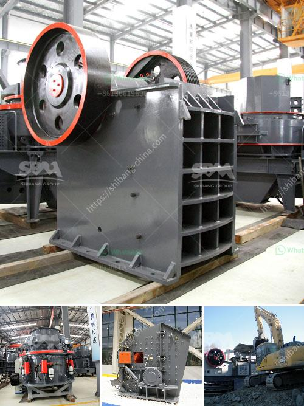

<h3>grinding garnet machine</h3>
Garnet, with its remarkable hardness and excellent abrasive properties, has been widely used in industrial applications for grinding and cutting purposes. To harness the maximum potential of garnet as an abrasive material, it is crucial to have an efficient and precise grinding garnet machine.

Grinding garnet machines are specifically designed to effectively grind this hard mineral to achieve superior outcomes in various industries such as metal fabrication, automotive, aerospace, and construction. These machines play a key role in shaping and finishing metallic and non-metallic surfaces, ensuring the desired level of smoothness and accuracy.

One of the most important factors to consider while grinding garnet is the choice of the appropriate grinding machine. The machine should be robust, durable, and efficient enough to withstand the demanding nature of garnet grinding. Companies like XYZ Machine Tools, Bradwell Engineering, and Abtec Industries offer a wide range of grinding machines designed to cater to the diverse needs of industrial applications.

The grinding garnet machine utilizes an abrasive wheel made up of a bonded abrasive compound, usually diamond or cubic boron nitride (CBN). The machine operates by rotating the abrasive wheel against the garnet material with a precise amount of pressure and speed, resulting in the removal of material layers from the workpiece's surface. The abrasive action of the grinding machine helps to smooth out surface irregularities and improve the overall finish of the garnet grinded material.

One of the significant advantages of a grinding garnet machine is its ability to remove material rapidly and efficiently. As the garnet is ground, the abrasive wheel constantly exposes new sharp cutting edges, ensuring an uninterrupted and efficient grinding process. This ability to maintain a consistent cutting action improves productivity, reduces grinding time, and minimizes the risk of overheating or damage to the workpiece.

Precision is another crucial aspect of grinding garnet machines. These machines are equipped with advanced controls and features that allow for precise adjustments, ensuring accurate and consistent grinding results. The ability to achieve fine-tuned control over settings such as speed, pressure, and depth of grind enables operators to meet specific requirements and achieve the desired level of accuracy and precision in the grinding process.

Furthermore, modern grinding garnet machines are often equipped with automated features and advanced technologies that enhance usability and efficiency. For example, CNC (Computer Numerical Control) systems allow for automated programming, reducing the need for manual intervention and maximizing productivity. Additionally, built-in sensors and monitoring systems enable operators to closely monitor the grinding process, ensuring optimal performance and minimizing the risk of errors or defects.

In conclusion, grinding garnet machines are vital tools in various industrial applications that require precise and efficient grinding operations. These machines, with their robust construction, advanced controls, and automated features, enhance productivity and ensure outstanding grinding results. By choosing the right machine for the job and utilizing the appropriate grinding techniques, businesses can unlock the full potential of garnet as an effective and reliable abrasive material. Whether in metal fabrication, automotive, aerospace, or construction, the grinding garnet machine plays a critical role in achieving the desired level of surface finish, smoothness, and accuracy, ultimately leading to superior quality products.
<h3>Contact us</h3><ul><li><strong>Whatsapp:&nbsp;<a href="https://wa.me/8613661969651">+8613661969651</a></strong></li><li><a href="https://swt.shibang-china.com/?git&amp;zhl&amp;grinding garnet machine"><strong>Online Service(chat now)</strong></a></li></ul><h3>Related</h3><ul><li><a href='cone crusher for sale philippines.md'>cone crusher for sale philippines</a></li><li><a href='china shanghai zenith company.md'>china shanghai zenith company</a></li><li><a href='jaw crusher for sale philippines.md'>jaw crusher for sale philippines</a></li><li><a href='malaysia memproses peralatan bijih besi.md'>malaysia memproses peralatan bijih besi</a></li><li><a href='super fine grinding mills.md'>super fine grinding mills</a></li></ul>