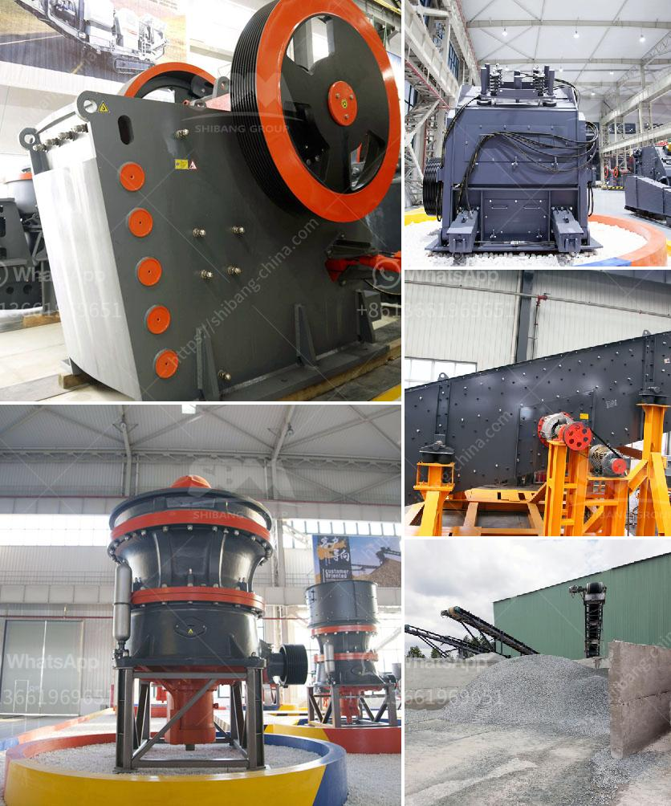

<h3>grinding machine kuwait for sale</h3>
Kuwait, a country known for its booming industrial sector and rapidly advancing economy, is constantly on the lookout for cutting-edge machinery that can enhance productivity and precision. One such machine that has gained significant popularity in recent years is the grinding machine. With its ability to perform crucial functions like cutting, shaping, and finishing solid materials, a grinding machine has become an integral part of industries such as manufacturing, automotive, aerospace, and more. In Kuwait, the demand for these machines has surged, leading to an increase in both supply and availability.

A grinding machine is a power tool that utilizes an abrasive wheel to smooth surfaces or remove excess material. It is widely used in various industries to improve the quality and accuracy of parts and components. These machines are designed to efficiently grind materials like metal, plastic, glass, and even wood. The versatility of grinding machines makes them highly sought after in the industrial sector in Kuwait.

With the evolution of technology, grinding machines have become more sophisticated and precise. Manufacturers are constantly developing new machines that offer advanced features and improved performance. In Kuwait, one can find a wide range of grinding machines for sale, suited for diverse industrial applications. These machines come in different sizes, capacities, and specifications, ensuring that every buyer can find the perfect fit for their specific requirements.

One of the key advantages of investing in a grinding machine in Kuwait is the high level of efficiency it brings to the production process. Unlike manual grinding, which can be time-consuming and prone to errors, grinding machines ensure consistent and accurate results. They can handle large volumes of work in a fraction of the time, allowing businesses to meet demanding deadlines and improve productivity.

Additionally, grinding machines offer significant cost savings in the long run. By automating the grinding process, companies can eliminate the need for manual labor and reduce human error. This not only saves time but also minimizes material wastage, resulting in reduced production costs. In a competitive market like Kuwait, where effective cost management is crucial, investing in a grinding machine can prove to be a wise decision.

When purchasing a grinding machine in Kuwait, buyers must consider several factors. It is essential to assess the specific needs of the industry, the type of materials to be ground, and the required precision level. It is also crucial to choose a reputable and reliable supplier that offers quality machines and excellent after-sales service. Researching customer reviews and seeking recommendations can greatly aid in finding the right supplier.

In conclusion, the availability of grinding machines for sale in Kuwait has significantly impacted the efficiency and accuracy of various industries. These machines, with their advanced features and high precision levels, have become a vital tool for businesses looking to enhance productivity and reduce costs. With the booming industrial sector and the increasing demand for precision machining, investing in a grinding machine is a step towards ensuring sustainable growth in Kuwait's industrial landscape.
<h3>Contact us</h3><ul><li><strong>Whatsapp:&nbsp;<a href="https://wa.me/8613661969651">+8613661969651</a></strong></li><li><a href="https://swt.shibang-china.com/?git&amp;zhl&amp;grinding machine kuwait for sale"><strong>Online Service(chat now)</strong></a></li></ul><h3>Related</h3><ul><li><a href='looking for washing plant for gold germany.md'>looking for washing plant for gold germany</a></li><li><a href='alluvial gold mining equipment price.md'>alluvial gold mining equipment price</a></li><li><a href='kaolin dry beneficiation.md'>kaolin dry beneficiation</a></li><li><a href='functions of the hammer mill.md'>functions of the hammer mill</a></li><li><a href='prices of stone crushers.md'>prices of stone crushers</a></li></ul>