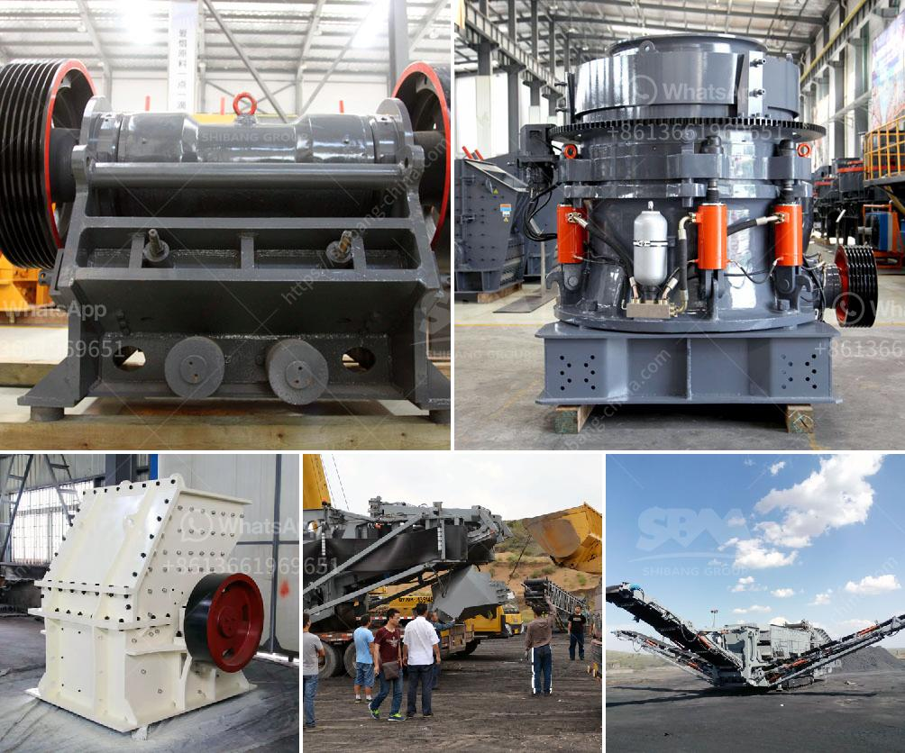

<h3>grinding machine manufacturer for 300 mesh powder</h3>
Grinding machines are extensively used in various industries to process raw materials into fine powders. A grinding machine crushes the material into fine particles and separates impurities through a process known as milling. This is achieved by passing the material through numerous small holes in a screen, known as a mesh.

When it comes to processing materials into 300 mesh powder, a specific type of grinding machine is required. A grinding machine manufacturer specializes in producing grinding machines that can process small particles, usually between 300 and 500 mesh. Often referred to as fine grinding equipment, these machines are capable of producing powders that are much finer than conventional grinding machines.

The grinding process involves the use of a variety of grinding tools, such as grinding wheels, abrasive belts, and grinding stones. These tools are mounted on grinding machines to perform different grinding tasks. Grinding machines come in various configurations, including vertical, horizontal, and cylindrical configurations. Each configuration serves a specific purpose and is used for grinding different types of materials.

A grinding machine manufacturer for 300 mesh powder understands the importance of producing high-quality machines that can provide optimal results for their customers. These manufacturers invest heavily in research and development to continuously improve the performance and efficiency of their machines. They also ensure that their machines are equipped with the latest technological advancements and features to meet the diverse needs of their clients.

One of the key features of grinding machines for 300 mesh powder is the availability of different types of screens or meshes. These screens are crucial in achieving the desired particle size of the powder. The mesh size determines the number of screening holes per square inch, which directly affects the particle size of the powder. A 300 mesh screen would have 300 holes per square inch, allowing only particles smaller than the hole size to pass through.

The process of manufacturing grinding machines for 300 mesh powder involves several stages. First, the raw materials are carefully selected to ensure their adequacy and quality. Next, these materials are processed and transformed into the required shape and size. The materials are then heated, cooled, and solidified to obtain the desired product characteristics. Finally, the finished product is thoroughly inspected and tested to ensure its quality and meet the specified standards.

In conclusion, a grinding machine manufacturer for 300 mesh powder plays a crucial role in producing high-quality machines that can efficiently grind materials into fine powders. These machines are designed to meet the specific needs of various industries and are equipped with advanced features and technologies. With their dedication to research and development, these manufacturers strive to continuously improve their machines to provide optimal performance and customer satisfaction. If you require fine grinding equipment for your business, it is essential to choose a reputable and experienced grinding machine manufacturer for reliable and efficient solutions.
<h3>Contact us</h3><ul><li><strong>Whatsapp:&nbsp;<a href="https://wa.me/8613661969651">+8613661969651</a></strong></li><li><a href="https://swt.shibang-china.com/?git&amp;zhl&amp;grinding machine manufacturer for 300 mesh powder"><strong>Online Service(chat now)</strong></a></li></ul><h3>Related</h3><ul><li><a href='crusher manufacturers in saudi.md'>crusher manufacturers in saudi</a></li><li><a href='trapezium mill south africa.md'>trapezium mill south africa</a></li><li><a href='advantages of hammer mill.md'>advantages of hammer mill</a></li><li><a href='rotary breaker for coal 200tph.md'>rotary breaker for coal 200tph</a></li><li><a href='ball mill problems in copper plant.md'>ball mill problems in copper plant</a></li></ul>