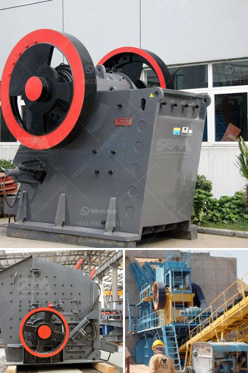

<h3>grinding machinery manufecture in africa</h3>
Africa is a vast and resource-rich continent that has the potential to become a major player in the global manufacturing industry. One area where Africa is making significant strides is in the manufacturing of grinding machinery. Grinding machinery plays a critical role in various industries such as mining, construction, agriculture, and manufacturing. It is used to remove material from a workpiece through abrasion, typically using a rotating grinding wheel.

In recent years, African countries have seen a growing demand for grinding machinery due to the continent's rapid industrialization. This surge in demand has led to the emergence of several grinding machinery manufacturers, catering to both local and international markets.

One of the primary drivers behind Africa's manufacturing growth is the abundance of raw materials and natural resources. For instance, many African countries are rich in minerals such as gold, diamonds, copper, and iron ore. The extraction and processing of these minerals require grinding machinery to efficiently crush and grind the ore into finer particles.

Additionally, Africa's burgeoning construction industry is another catalyst for the growth of grinding machinery manufacturing. The need for massive infrastructure development, including roads, bridges, and buildings, necessitates the use of grinding machinery to prepare surfaces for construction. Grinding machinery ensures that surfaces are smooth, level, and ready for further construction work.

Furthermore, the agricultural sector is another key beneficiary of Africa's grinding machinery manufacturing. Small- and large-scale farmers require grinding machinery to process crops such as maize, wheat, sorghum, and rice. These machines are crucial in turning the harvested crops into flour, making them suitable for various food products.

Several African countries, including South Africa, Egypt, Ghana, and Nigeria, are at the forefront of grinding machinery manufacturing on the continent. In these countries, both small-scale and large-scale manufacturers are producing high-quality grinding machinery capable of meeting the diverse needs of African industries.

Local manufacturers in Africa have demonstrated their capacity to deliver world-class grinding machinery by leveraging technological advancements and collaboration with international partners. They have invested in research and development, ensuring that their products are efficient, durable, and cost-effective.

Moreover, the manufacturing sector in Africa has received support from both private and public entities. Governments have implemented policies and provided incentives to encourage local manufacturing, promoting job creation and economic growth. International development organizations and investors have also contributed to the growth of grinding machinery manufacturing in Africa by funding and providing technical support to local manufacturers.

The manufacturing of grinding machinery in Africa presents numerous opportunities for the continent's economic development. It creates jobs, fosters technological innovation, and reduces dependence on imported machinery. Additionally, local manufacturing ensures that grinding machinery is tailored to the specific needs of African industries, resulting in improved productivity and efficiency.

In conclusion, Africa's grinding machinery manufacturing sector is witnessing remarkable growth and development. The continent's vast resources, growing industrialization, and supportive policies have contributed to the emergence of several local manufacturers producing high-quality grinding machinery. This development bodes well for Africa's economic growth and its ability to meet the grinding machinery needs of various industries. With continued investment and support, Africa has the potential to become a global leader in grinding machinery manufacture.
<h3>Contact us</h3><ul><li><strong>Whatsapp:&nbsp;<a href="https://wa.me/8613661969651">+8613661969651</a></strong></li><li><a href="https://swt.shibang-china.com/?git&amp;zhl&amp;grinding machinery manufecture in africa"><strong>Online Service(chat now)</strong></a></li></ul><h3>Related</h3><ul><li><a href='buy gravel crusher.md'>buy gravel crusher</a></li><li><a href='suppliers of mining equipment in south africa.md'>suppliers of mining equipment in south africa</a></li><li><a href='pakistan chromite crusher equipment.md'>pakistan chromite crusher equipment</a></li><li><a href='raymond mills usa.md'>raymond mills usa</a></li><li><a href='picture of complete of quarry crushing plant nigeria.md'>picture of complete of quarry crushing plant nigeria</a></li></ul>