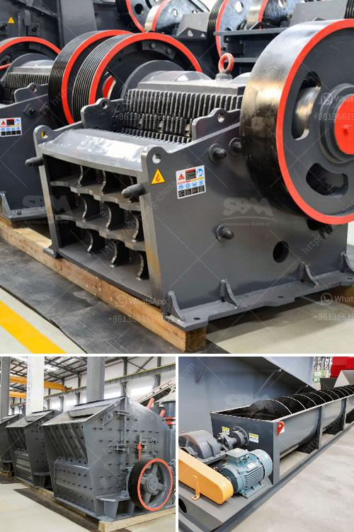

<h3>grinding mill for limestone italy</h3>
Grinding mills are highly crucial in limestone processing operations. In order to meet the needs of customers, rigorous testing and research have been undertaken in recent years to develop high-quality grinding mill for limestone Italy. These advanced technologies have not only helped improve productivity but also enhance the overall efficiency of limestone processing.

The limestone grinding mill mainly relies on the grinding roller and ring to grind the limestone material. During the grinding process, the material is ground by the grinding roller and the grinding ring under the action of centrifugal force. The grinding roller and the grinding ring have a long service life, and the internal structure of the grinding mill is compact, which saves a significant amount of space.

In addition, the limestone grinding mill has a high grinding efficiency. The grinding mill uses a classifier, so the fineness of the limestone powder is controlled and can be adjusted according to the desired amount. The fineness can be as fine as 325 mesh, or even reach 3000 mesh, which can greatly satisfy the grinding needs of customers.

One of the key advantages of the limestone grinding mill in Italy is the high output. The grinding mills designed by Italian manufacturers are powerful and can grind large quantities of limestone into fine powder. This capability significantly reduces the overall processing time of limestone and increases the output.

Furthermore, the limestone grinding mill in Italy has a relatively low energy consumption. The grinding mill uses a precise and energy-saving motor, which reduces the energy loss in the transmission process, ensuring that the limestone grinding mill operates at a low power consumption. This not only saves energy but also reduces the operating costs for limestone processing.

Another important aspect of the limestone grinding mill in Italy is its versatility. These mills can grind various materials, including limestone, marble, and barite, among others. This wide range of grinding capabilities makes the mill suitable for a variety of industries, such as construction, chemical, mining, and metallurgy.

In conclusion, the limestone grinding mill in Italy is a highly efficient and versatile grinding solution that can provide high-quality limestone powder for various applications. With advanced technologies and precise engineering, these mills are capable of delivering consistent and reliable performance. Whether it is for construction or manufacturing purposes, the limestone grinding mill in Italy is an essential tool that can greatly enhance productivity and efficiency in limestone processing operations.
<h3>Contact us</h3><ul><li><strong>Whatsapp:&nbsp;<a href="https://wa.me/8613661969651">+8613661969651</a></strong></li><li><a href="https://swt.shibang-china.com/?git&amp;zhl&amp;grinding mill for limestone italy"><strong>Online Service(chat now)</strong></a></li></ul><h3>Related</h3><ul><li><a href='roller crusher equipment manufacturer.md'>roller crusher equipment manufacturer</a></li><li><a href='pakistan chromite crusher equipment.md'>pakistan chromite crusher equipment</a></li><li><a href='materials used in mining gold and diamond.md'>materials used in mining gold and diamond</a></li><li><a href='crushers for rent cincinnati.md'>crushers for rent cincinnati</a></li><li><a href='project feasibility report on stone crusher.md'>project feasibility report on stone crusher</a></li></ul>