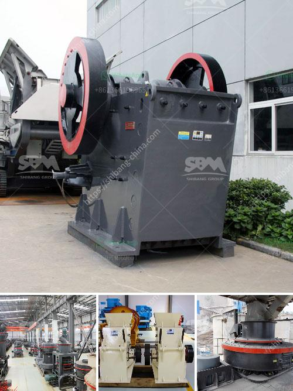

<h3>grinding mill for limestone upto 2 microns</h3>
Grinding mill for limestone is used to produce fine limestone powder. The grinding mill can grind the limestone particles into 2 micron in the process of grinding mill, limestone will be grounded to fine powder and the combination of the limestone powder and the water mixed glue will have good viscosity, so there are some products which can be extruded by grinding mill, the sizes of limestone particles can be reduced to 2 microns. 

The grinding mill is efficient and reliable equipment for grinding limestone, it is more energysaving than ordinary grinding mill and can be your ideal limestone grinding mill. The grinding mill is equipped with a high-efficiency separator, which effectively classifies the crushed limestone powder and ensures the finished product's uniform particle size distribution. 

With advanced technology, the grinding mill for limestone can grind limestone into powder, adjustable between 325-2500 mesh. It has comprehensive mechanical, crushing, grinding, and grading functions, and the limestone powder is of high quality. The limestone grinding mill can grind the limestone particles into 2 microns, which increases the limestone utilization rate and improves the added value of limestone products. 

The grinding mill for limestone is widely used in various industries such as power plants, metallurgy, chemical industry, and cement. It not only grinds limestone, but also grinds other materials, such as bentonite, slag, and clinker. So, it is a multi-purpose grinding mill which can meet the needs of different industries. 

In conclusion, the grinding mill for limestone up to 2 microns can meet the processing needs of various industries. It is a practical choice for increasing the utilization rate of limestone resources and promoting the sustainable development of limestone industry. With its advanced technology, efficient performance, and reliable quality, the limestone grinding mill is your ideal choice for grinding limestone into fine powder.
<h3>Contact us</h3><ul><li><strong>Whatsapp:&nbsp;<a href="https://wa.me/8613661969651">+8613661969651</a></strong></li><li><a href="https://swt.shibang-china.com/?git&amp;zhl&amp;grinding mill for limestone upto 2 microns"><strong>Online Service(chat now)</strong></a></li></ul><h3>Related</h3><ul><li><a href='talcum powder philling machine.md'>talcum powder philling machine</a></li><li><a href='how to make a iron ore crusher machine.md'>how to make a iron ore crusher machine</a></li><li><a href='stone crusher price of ton per day.md'>stone crusher price of ton per day</a></li><li><a href='products lm vertical grinding mills.md'>products lm vertical grinding mills</a></li><li><a href='hammer mill for plants.md'>hammer mill for plants</a></li></ul>