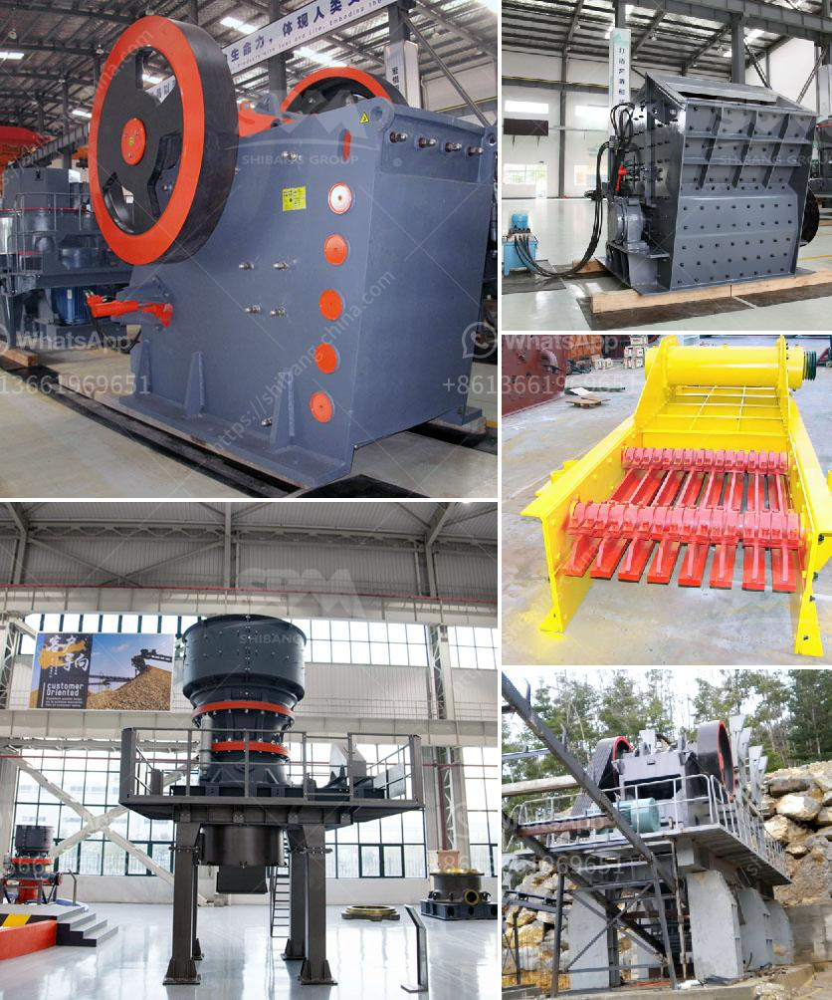

<h3>grinding mill for red oxide ore</h3>
Red oxide ore, commonly known as hematite, is a type of iron oxide ore with the chemical formula Fe2O3. It is an important industrial raw material, as it contains iron, one of the most widely used metals globally. The grinding of red oxide ore plays a vital role in enhancing the iron content and subsequent extraction of iron from this ore.

The grinding mill specifically designed for red oxide ore is often referred to as red oxide ore ball mill or red oxide ore mill. The grinding process of red oxide ore includes crushing, grinding, and classification. The crushed ore is conveyed to a ball mill, wherein the ore is further ground using steel balls. The finely ground ore undergoes classification, with the fines being separated from the coarse particles. The classified ore is then stored in silos or tanks before further processing.

There are several factors to consider while selecting the appropriate grinding mill for red oxide ore. These factors include the ore's hardness, moisture content, desired particle size, and the required output capacity. Additionally, the choice of grinding mill depends on the scale of mining operations and the total investment available. Commonly used grinding mills for red oxide ore include ball mills, vertical roller mills, and Raymond mills.

Ball mills are widely used in the grinding process due to their simplicity and efficiency. These mills consist of a rotating shell filled with steel balls, which grind the ore by impact and attrition. They are suitable for both wet and dry grinding, making them adaptable to various ore conditions. The high energy efficiency of ball mills ensures effective grinding with minimal energy consumption.

Vertical roller mills (VRM) utilize two large rollers to grind the ore. These mills offer higher grinding efficiency and lower energy consumption compared to ball mills. The ore is crushed between the rollers and ground by compression and shear forces. VRMs can handle higher throughputs and provide better particle size distribution control.

Raymond mills, also known as roller mills, are widely used for grinding various materials, including red oxide ore. These mills consist of a rotating bowl with rollers, which move in a circular motion. The ore is fed into the bowl and ground between the rollers and bowl, providing efficient grinding at a lower cost.

Red oxide ore grinding mills play a crucial role in the separation and extraction of the iron content from the ore. Once the ore is sufficiently ground, it undergoes further processing steps, including magnetic separation and flotation, to obtain pure iron concentrates. The iron concentrates are then smelted and refined to produce high-quality iron and steel products.

In conclusion, red oxide ore grinding mills are essential in the beneficiation process of red oxide ore. These mills ensure efficient grinding of the ore, resulting in improved iron recovery. Ball mills, vertical roller mills, and Raymond mills are commonly used grinding mills for red oxide ore. The choice of grinding mill depends on various factors, such as ore characteristics, desired particle size, and production capacity. Understanding the grinding process aids in maximizing the iron extraction and improving the overall productivity of mining operations.
<h3>Contact us</h3><ul><li><strong>Whatsapp:&nbsp;<a href="https://wa.me/8613661969651">+8613661969651</a></strong></li><li><a href="https://swt.shibang-china.com/?git&amp;zhl&amp;grinding mill for red oxide ore"><strong>Online Service(chat now)</strong></a></li></ul><h3>Related</h3><ul><li><a href='jaw crusher 600x900 indonesia.md'>jaw crusher 600x900 indonesia</a></li><li><a href='steel hammer mill.md'>steel hammer mill</a></li><li><a href='balast crushing machine kenya.md'>balast crushing machine kenya</a></li><li><a href='how does a quarry operate complete crushing palnt.md'>how does a quarry operate complete crushing palnt</a></li><li><a href='mobile copper ore shaking table.md'>mobile copper ore shaking table</a></li></ul>