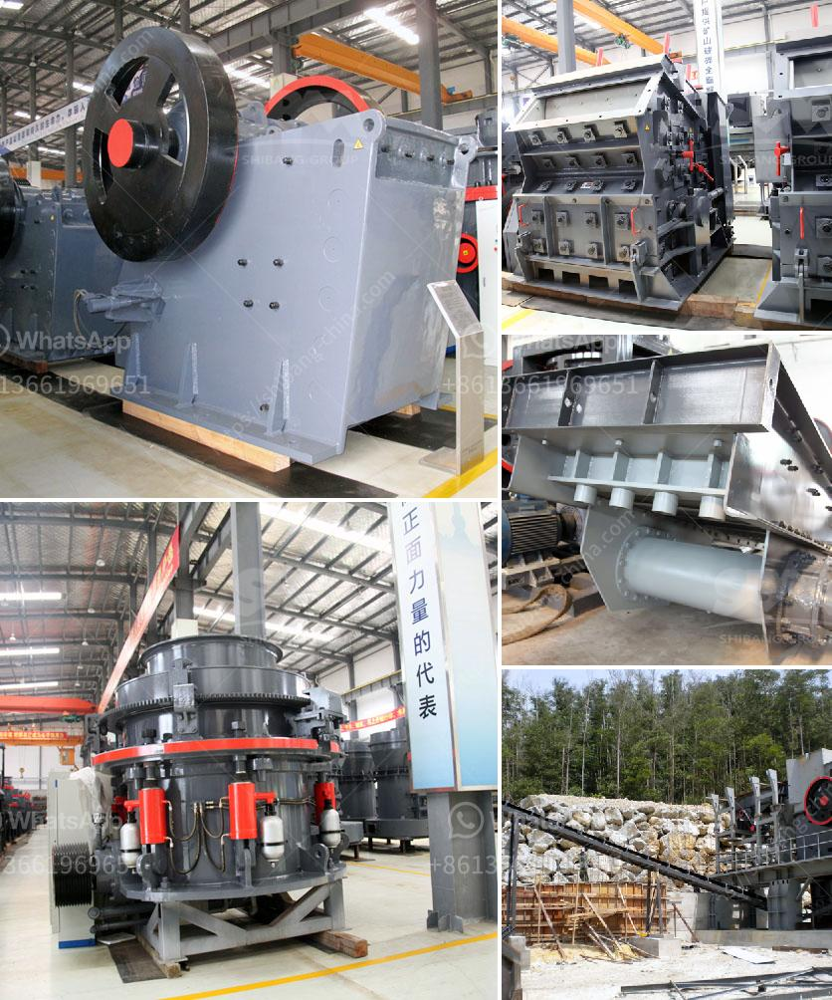

<h3>grinding mill for sale zimbabwe</h3>
Zimbabwe, a country rich in natural resources, is currently home to one of the most thriving milling industries across the African continent. Boasting numerous minerals and a highly skilled workforce, Zimbabwe has paved its way as a global player in the production of high-quality grinding mills. With a wide range of options available, finding the perfect grinding mill for sale in Zimbabwe has become seamless.

The grinding mill industry in Zimbabwe is thriving because not only is it profitable, but it also fulfills a fundamental need. Many people want to buy maize millers in Zimbabwe or rice or other grain mills, such as small grain mills, and large-scale mills that can deliver medium to large-scale production. These maize milling machines are robust and easy to operate, and they can produce quality mealie meal for both urban and rural consumers.

When searching for grinding mills for sale, Zimbabwe residents and businesses alike prioritize functionality and efficiency. These mills are capable of processing a wide range of grains, including maize, wheat, and sorghum, ensuring a consistent, high-quality end product. In addition, they come in various sizes and capacities to cater to different milling needs, making them suitable for both small-scale and large-scale operations.

Investing in a grinding mill for sale in Zimbabwe has been greatly rewarding for both small local businesses and large-scale industrial operations. Not only has it contributed to the economic growth of the country, but it has also improved the livelihoods of countless individuals. By providing employment opportunities and ensuring food security, the grinding mill industry has played a pivotal role in Zimbabwe's development.

For individuals or businesses considering purchasing a grinding mill in Zimbabwe, there are several reputable suppliers and manufacturers to choose from. These suppliers provide after-sales service and support, ensuring that the mills are maintained and repaired when necessary. Additionally, most suppliers offer flexible payment options to accommodate different financial capabilities.

In conclusion, the availability of grinding mills for sale in Zimbabwe has revolutionized the milling industry, contributing significantly to the economic growth and development of the country. With a diverse range of options available, everyone can find a mill that suits their specific needs. Whether it be for small-scale production or large-scale industrial operations, these grinding mills have proven to be reliable, efficient, and profitable. Zimbabwe stands as a shining example of a country that has embraced the milling industry and reaped its rewards.
<h3>Contact us</h3><ul><li><strong>Whatsapp:&nbsp;<a href="https://wa.me/8613661969651">+8613661969651</a></strong></li><li><a href="https://swt.shibang-china.com/?git&amp;zhl&amp;grinding mill for sale zimbabwe"><strong>Online Service(chat now)</strong></a></li></ul><h3>Related</h3><ul><li><a href='mobile stone crushing plant.md'>mobile stone crushing plant</a></li><li><a href='clinker grinding unit for cement clinker in india.md'>clinker grinding unit for cement clinker in india</a></li><li><a href='calcite processing machine.md'>calcite processing machine</a></li><li><a href='how to acid washing silica sand.md'>how to acid washing silica sand</a></li><li><a href='construction of a clinker plant.md'>construction of a clinker plant</a></li></ul>